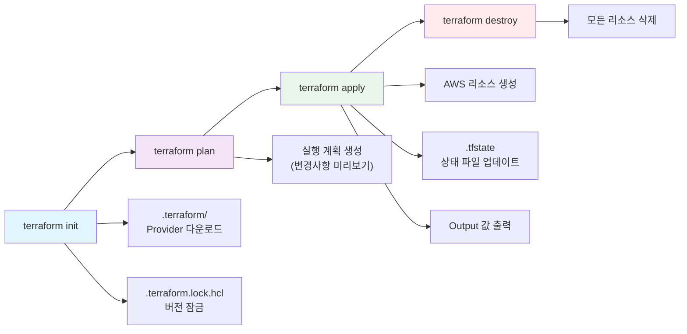
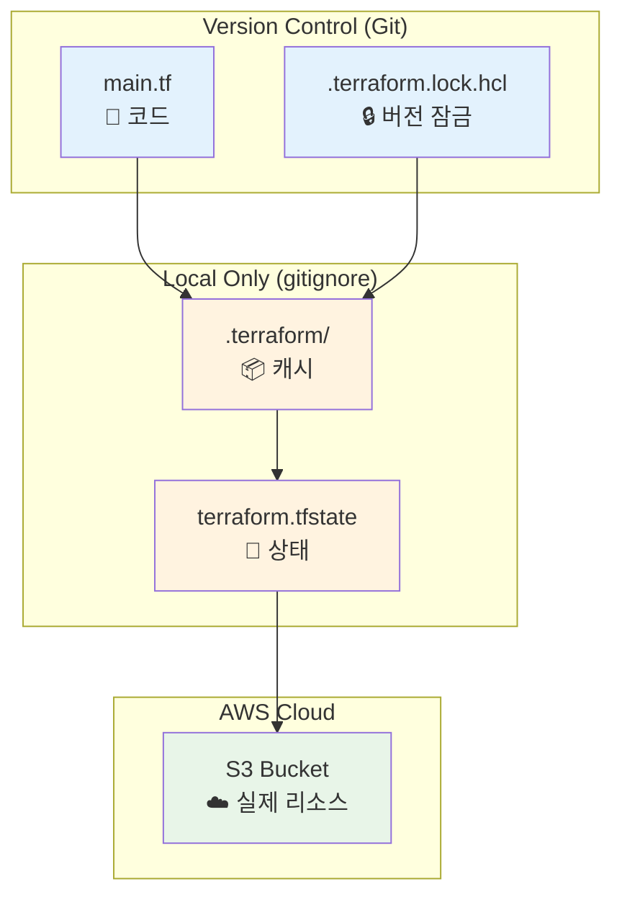
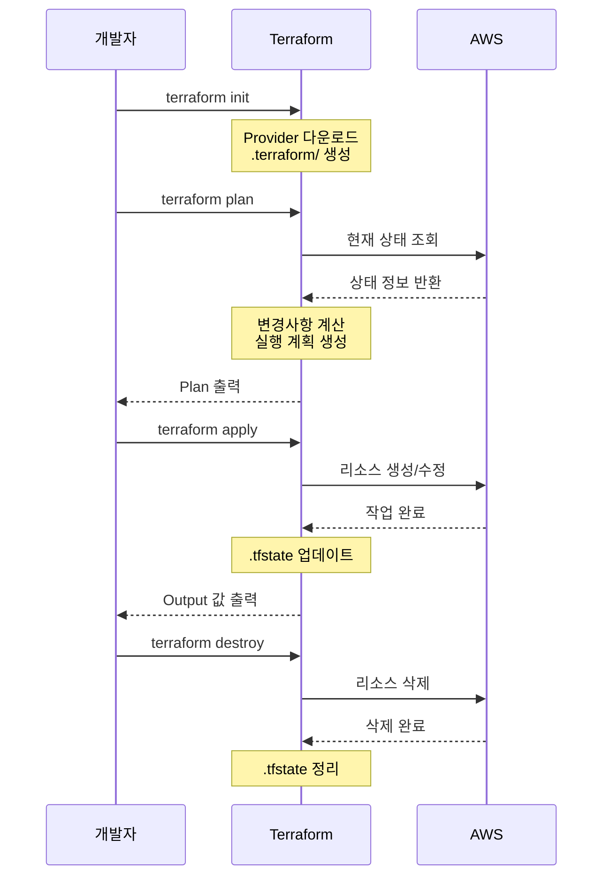

# 00. provider setup

Terraform 설치 및 설정, HCL 문법, init·plan·apply 워크플로우, 상태 파일 개념

## 1. Terraform 설치

- https://developer.hashicorp.com/terraform/install 참고
- 또는 `tfenv`, `tfswitch`를 이용해 원하는 버전 설치
- 저는 [tfswitch](https://tfswitch.warrensbox.com/)를 이용했습니다.
- terraform 버전은 `1.12.2`를 사용했습니다.

```bash
terraform --version
Terraform v1.12.2
on windows_amd64
```

<br>

## 2. AWS 인증 정보 설정 (`~/.aws/credentials` 파일에 인증 정보 저장)

[AWS CLI](https://docs.aws.amazon.com/ko_kr/cli/latest/userguide/getting-started-install.html)를 먼저 설치하고 아래 명령어로 설정:

```bash
aws configure
```

입력 항목:

```bash
AWS Access Key ID [None]: your_access_key
AWS Secret Access Key [None]: your_secret_key
Default region name [None]: ap-northeast-2
Default output format [None]: json
```

입력 후

```bash
aws sts get-caller-identity
```

명령어로 확인.

파일은

```bash
~/.aws/credentials
~/.aws/config
```

여기에 저장되고, Terraform은 자동으로 이 파일들을 인식

<br>

## Terraform 언어 개요

Terraform 언어의 주요 목적은 인프라 객체를 코드로 선언하여 관리하는 것
선언적(Declarative) 언어 특성에 따라, “어떤 상태”를 달성할지 정의하고, 그 상태를 실제로 만들기 위한 단계별 절차는 Terraform이 자동으로 처리

### 1. 기본 구문 예시

```hcl
resource "aws_vpc" "main" {
  cidr_block = var.base_cidr_block
}
```

위 예시에서:

- `resource`
  - **블록 타입(Block Type)**
  - 특정 리소스(여기서는 AWS VPC)를 정의하기 위한 컨테이너 역할
- `"aws_vpc"`, `"main"`
  - **블록 레이블(Block Label)**
  - 첫 번째 레이블은 리소스 타입 식별자, 두 번째 레이블은 해당 리소스의 논리적 이름
- `cidr_block = var.base_cidr_block`
  - **인자(Argument)**
  - `cidr_block`이라는 속성에 `var.base_cidr_block` 값을 할당

### 2. Terraform 블록(Block)

```hcl
<BLOCK TYPE> "<LABEL1>" "<LABEL2>" {
  # (1) Argument
  <IDENTIFIER> = <EXPRESSION>

  # (2) 중첩된 Block
  <BLOCK TYPE> "<SUB-LABEL>" {
    ...
  }
}
```

- **블록 타입(Block Type)**
  - `resource`, `data`, `module`, `provider`, `variable`, `output`, `locals`
  - 블록이 어떤 기능·목적을 가지는지 지정
- **블록 레이블(Block Label)**
  - 0개 또는 1개 이상
  - 식별용 이름:
    - 문자열(`"..."`) 또는 숫자
    - 허용 문자: 영문 대소문자, 숫자, `_`, `-`
    - 첫 글자는 숫자 불가
- **블록 바디(Body)**
  - 여러 개의 **인자(Argument)**
  - 다른 블록을 **중첩(Nested Block)** 형태로 포함 가능

### 3. 인자(Argument)와 표현식(Expression)

- **인자(Identifier)**
  - 블록 바디 내부에 `키 = 값` 형태로 작성
  - 키 이름도 `_`, `-` 허용, 숫자 첫 글자 불가
- **표현식(Expression)**
  - **리터럴**: `"string"`, `123`, `true`
  - **참조**: `var.some_var`, `local.other`, `aws_instance.example.id`
  - **함수 호출**: `join(",", var.list)`, `length(var.map)`
  - 복합 연산: `"prefix-${var.name}-suffix"` 등

### 4. 선언적(Declarative) 특성

- 최종 목표(State)만을 기술하고,
- 실행 순서나 단계(step-by-step)는 Terraform이 내부적으로 계획(`terraform plan`)하고 적용(`terraform apply`)
- 블록·인자·파일 순서는 대체로 순서 무관
- 코드 변경 시 Terraform이 상태(State)를 비교하여 필요한 작업만 수행

<br>

## 4. Terraform 파일 구조

Terraform 으로 init, plan, apply 명령을 하게 되면 현재 사용자의 디렉토리 상에서 `.tf` 파일, `.tf.json` 파일을 찾게 되는데, 하위 디렉토리에 대해서는 탐색을 하지 않는다.

.tf 파일을 작성할 때는 인코딩을 항상 UTF-8로 설정해야 한다.

.tf 파일을 가지고 있는 디렉토리를 `Module` 이라고 부른다.  
Module은 `Root Module`과 `Child Module`로 나뉜다.

```
dir/
- a
- b
- c
```

디렉토리에 a, b, c 디렉토리(모듈)가 있고, c 모듈이 a, b 모듈을 가져다 쓴다고 해보자.  
c에서 terraform apply를 수행하면 c는 root module, a, b는 child module이 된다.

a 에서 apply를 하면 a가 root module이 된다.

## 5. Terraform Style Conventions

1. indent는 tab이 아닌 two space
2. Block 내에 여러 Arguments를 정의할 때는 = 을 기준으로 key와 value를 정의한다.
3. Resource를 정의할 때는 meta-argument들이 있는데 count, for each는 머리 부분에 위치하는 것을 선호하고 lifecycle이나 depends on은 하단부에 위치하는 것을 선호한다.
4. `terraform fmt -diff` 명령어를 사용하면 tf 파일에 작성된 코드들을 컨벤션에 맞게 알맞게 수정해준다.

## 6. 실습

### 6.1 main.tf 작성

```hcl
terraform {
  required_version = ">=1.12.2"

  required_providers {
    aws = {
      source  = "hashicorp/aws"
      version = "~> 5.0"
    }
  }
}

provider "aws" {
  region = "ap-northeast-2"
}

# 간단한 S3 버킷 생성 (실습용)
resource "aws_s3_bucket" "terraform_practice" {
  bucket = "terraform-practice-${random_string.suffix.result}"
}

resource "random_string" "suffix" {
  length  = 8
  special = false
  upper   = false
}

# 출력값 정의
output "bucket_name" {
  value = aws_s3_bucket.terraform_practice.bucket
}

output "bucket_arn" {
  value = aws_s3_bucket.terraform_practice.arn
}
```

1. terraform 블록(설정 블록)

   ```hcl
   terraform {
     required_version = ">=1.12.2"

     required_providers {
       aws = {
         source  = "hashicorp/aws"
         version = "~> 5.0"
       }
     }
   }
   ```

   Terraform 자체의 요구사항을 정의하는 메타 설정

   Argument

   - required_version = ">= 1.12.2"  
     Terraform 1.12.2 이상에서만 실행 가능  
     없으면 어떤 버전에서든 실행되지만 호환성 문제 발생 가능함

   - required_providers  
     외부 provider 사용시 작성 권장됨
     - source = "hashicorp/aws"  
       Provider 출처(Terraform Registry)
     - version = "~> 5.0"  
       AWS Provider 5.x 버전만 허용

2. provider 블록(제공자 설정)

   ```hcl
   provider "aws" {
     region = "ap-northeast-2"
   }
   ```

   AWS 와의 연결 설정 정의

   Argument

   - region = "ap-northeast-2"  
     기본값 있지만 명시 권장됨  
     서울 리전에 리소스 생성

   - 다른 옵션들

   ```hcl
   provider "aws" {
     region     = "ap-northeast-2"
     access_key = "AKIA..."        # 보통 환경변수 사용
     secret_key = "..."            # 보통 환경변수 사용
     profile    = "my-profile"     # AWS CLI 프로필 사용
   }
   ```

3. resource 블록(리소스 정의)

   3.1 S3 버킷 리소스

   ```hcl
   resource "aws_s3_bucket" "terraform_practice" {
     bucket = "terraform-practice-${random_string.suffix.result}"
   }
   ```

   실제 AWS S3 버킷 생성

   Arguments

   - bucket = "terraform-practice-${random_string.suffix.result}"  
     버킷 이름 지정  
     필수 아님, 없으면 AWS가 자동 생성  
     전 세계적으로 유니크해야 함, 소문자, 숫자, 하이픈만 가능

     `${}`: Terraform 문법으로 다른 리소스 값 참조

   - 다른 가능한 arguments

     ```hcl
     resource "aws_s3_bucket" "example" {
       bucket        = "my-bucket"
       force_destroy = true              # 파일 있어도 강제 삭제

       tags = {
         Environment = "Dev"
         Project     = "MyProject"
       }
     }
     ```

     3.2 Random String 리소스(Random Provider에서 제공)

   ```hcl
   resource "random_string" "suffix" {
     length  = 8
     special = false
     upper   = false
   }
   ```

   랜덤 문자열 생성(버킷 이름 중복 방지용)

   Arguments

   - length = 8  
     필수, 생성할 문자열의 자릿수

   - special = false  
     특수문자 제외
   - upper = false  
     대문자 제외

   - 다른 옵션들

     ```hcl
     resource "random_string" "example" {
       length  = 16
       special = true     # !@#$ 포함
       upper   = true     # ABC 포함
       lower   = true     # abc 포함
       numeric = true     # 123 포함
       min_lower = 2      # 최소 소문자 2개
     }
     ```

4. output 블록 (출력값 정의)

   ```hcl
   output "bucket_name" {
     value = aws_s3_bucket.terraform_practice.bucket
   }

   output "bucket_arn" {
     value = aws_s3_bucket.terraform_practice.arn
   }
   ```

   Terraform 실행 후 결과값 출력

   Arguments

   - value = aws_s3_bucket.terraform_practice.bucket  
     필수, 생성된 S3 버킷의 이름 출력  
     리소스타입.리소스이름.속성

   - 다른 옵션들

   ```hcl
   output "bucket_info" {
     value = aws_s3_bucket.terraform_practice.bucket
     description = "생성된 S3 버킷 이름"
     sensitive = false  # true면 터미널에 ***로 표시
   }
   ```

### 6.2 초기화: terraform init

.tf 파일에 정의된 provider 다운로드

```bash
terraform-practice\00-provider-setup>terraform init
Initializing the backend...
Initializing provider plugins...
- Finding hashicorp/aws versions matching "~> 5.0"...
- Finding latest version of hashicorp/random...
- Installing hashicorp/aws v5.100.0...
- Installed hashicorp/aws v5.100.0 (signed by HashiCorp)
- Installing hashicorp/random v3.7.2...
- Installed hashicorp/random v3.7.2 (signed by HashiCorp)
Terraform has created a lock file .terraform.lock.hcl to record the provider
selections it made above. Include this file in your version control repository
so that Terraform can guarantee to make the same selections by default when
you run "terraform init" in the future.

Terraform has been successfully initialized!

You may now begin working with Terraform. Try running "terraform plan" to see
any changes that are required for your infrastructure. All Terraform commands
should now work.

If you ever set or change modules or backend configuration for Terraform,
rerun this command to reinitialize your working directory. If you forget, other
commands will detect it and remind you to do so if necessary.
```

### 6.3 .terraform 디렉토리 및 .terraform.lock.hcl 파일 생성 확인

#### 6.3.1 terraform init으로 생성된 파일/디렉토리 분석

**1. .terraform/ 디렉토리**

```bash
.terraform/
├── providers/
│   └── registry.terraform.io/
│       ├── hashicorp/aws/5.100.0/
│       └── hashicorp/random/3.7.2/
└── modules/
```

역할:

- Provider 바이너리 파일 저장소 (캐시)
- 다운로드된 모듈 저장
- gitignore에 포함해야 함 - 용량이 크고 재생성 가능

<br>

**2. .terraform.lock.hcl 파일**

```hcl
provider "registry.terraform.io/hashicorp/aws" {
  version     = "5.100.0"
  constraints = "~> 5.0"
  hashes = [
    "h1:abc123...",
    "h1:def456...",
  ]
}
```

역할:

- Dependency Lock File - 정확한 provider 버전 고정
- 팀 협업 시 모든 개발자가 동일한 버전 사용 보장
- 반드시 git에 포함해야 함 (package-lock.json과 같은 역할)

### 6.4 실행 계획 확인: terraform plan

```bash
terraform-practice\00-provider-setup>terraform plan

Terraform used the selected providers to generate the following execution plan. Resource actions are indicated with the following symbols:
  + create

Terraform will perform the following actions:

  # aws_s3_bucket.terraform_practice will be created
  + resource "aws_s3_bucket" "terraform_practice" {
      + acceleration_status         = (known after apply)
      + acl                         = (known after apply)
      + arn                         = (known after apply)
      + bucket                      = (known after apply)
      + bucket_domain_name          = (known after apply)
      + bucket_prefix               = (known after apply)
      + bucket_regional_domain_name = (known after apply)
      + force_destroy               = false
      + hosted_zone_id              = (known after apply)
      + id                          = (known after apply)
      + object_lock_enabled         = (known after apply)
      + policy                      = (known after apply)
      + region                      = (known after apply)
      + request_payer               = (known after apply)
      + tags_all                    = (known after apply)
      + website_domain              = (known after apply)
      + website_endpoint            = (known after apply)

      + cors_rule (known after apply)

      + grant (known after apply)

      + lifecycle_rule (known after apply)

      + logging (known after apply)

      + object_lock_configuration (known after apply)

      + replication_configuration (known after apply)

      + server_side_encryption_configuration (known after apply)

      + versioning (known after apply)

      + website (known after apply)
    }

  # random_string.suffix will be created
  + resource "random_string" "suffix" {
      + id          = (known after apply)
      + length      = 8
      + lower       = true
      + min_lower   = 0
      + min_numeric = 0
      + min_special = 0
      + min_upper   = 0
      + number      = true
      + numeric     = true
      + result      = (known after apply)
      + special     = false
      + upper       = false
    }

Plan: 2 to add, 0 to change, 0 to destroy.

Changes to Outputs:
  + bucket_arn  = (known after apply)
  + bucket_name = (known after apply)

─────────────────────────────────────────────────────────────────────────────────────────────────────────────────────────────────────────────────────────────────────────────────────────────────────────────────────────────────

Note: You didn't use the -out option to save this plan, so Terraform can't guarantee to take exactly these actions if you run "terraform apply" now.
```

### 6.5 리소스 생성: terraform apply

```bash
terraform-practice\00-provider-setup>terraform apply

Terraform used the selected providers to generate the following execution plan. Resource actions are indicated with the following symbols:
  + create

Terraform will perform the following actions:

  # aws_s3_bucket.terraform_practice will be created
  + resource "aws_s3_bucket" "terraform_practice" {
      + acceleration_status         = (known after apply)
      + acl                         = (known after apply)
      + arn                         = (known after apply)
      + bucket                      = (known after apply)
      + bucket_domain_name          = (known after apply)
      + bucket_prefix               = (known after apply)
      + bucket_regional_domain_name = (known after apply)
      + force_destroy               = false
      + hosted_zone_id              = (known after apply)
      + id                          = (known after apply)
      + object_lock_enabled         = (known after apply)
      + policy                      = (known after apply)
      + region                      = (known after apply)
      + request_payer               = (known after apply)
      + tags_all                    = (known after apply)
      + website_domain              = (known after apply)
      + website_endpoint            = (known after apply)

      + cors_rule (known after apply)

      + grant (known after apply)

      + lifecycle_rule (known after apply)

      + logging (known after apply)

      + object_lock_configuration (known after apply)

      + replication_configuration (known after apply)

      + server_side_encryption_configuration (known after apply)

      + versioning (known after apply)

      + website (known after apply)
    }

  # random_string.suffix will be created
  + resource "random_string" "suffix" {
      + id          = (known after apply)
      + length      = 8
      + lower       = true
      + min_lower   = 0
      + min_numeric = 0
      + min_special = 0
      + min_upper   = 0
      + number      = true
      + numeric     = true
      + result      = (known after apply)
      + special     = false
      + upper       = false
    }

Plan: 2 to add, 0 to change, 0 to destroy.

Changes to Outputs:
  + bucket_arn  = (known after apply)
  + bucket_name = (known after apply)

Do you want to perform these actions?
  Terraform will perform the actions described above.
  Only 'yes' will be accepted to approve.

  Enter a value: yes

random_string.suffix: Creating...
random_string.suffix: Creation complete after 0s [id=2c30jxhc]
aws_s3_bucket.terraform_practice: Creating...
aws_s3_bucket.terraform_practice: Creation complete after 2s [id=terraform-practice-2c30jxhc]

Apply complete! Resources: 2 added, 0 changed, 0 destroyed.

Outputs:

bucket_arn = "arn:aws:s3:::terraform-practice-2c30jxhc"
bucket_name = "terraform-practice-2c30jxhc"
```

### 6.6 생성된 리소스 확인 terraform show, terraform state list

```bash
terraform-practice\00-provider-setup>terraform show
# aws_s3_bucket.terraform_practice:
resource "aws_s3_bucket" "terraform_practice" {
    acceleration_status         = null
    arn                         = "arn:aws:s3:::terraform-practice-2c30jxhc"
    bucket                      = "terraform-practice-2c30jxhc"
    bucket_domain_name          = "terraform-practice-2c30jxhc.s3.amazonaws.com"
    bucket_prefix               = null
    bucket_regional_domain_name = "terraform-practice-2c30jxhc.s3.ap-northeast-2.amazonaws.com"
    force_destroy               = false
    hosted_zone_id              = "Z3W03O7B5YMIYP"
    id                          = "terraform-practice-2c30jxhc"
    object_lock_enabled         = false
    policy                      = null
    region                      = "ap-northeast-2"
    request_payer               = "BucketOwner"
    tags_all                    = {}

    grant {
        id          = "f5471383bf787d91480a692df948d61cc8ec77857bc1b17b89454999f8779dab"
        permissions = [
            "FULL_CONTROL",
        ]
        type        = "CanonicalUser"
        uri         = null
    }

    server_side_encryption_configuration {
        rule {
            bucket_key_enabled = false

            apply_server_side_encryption_by_default {
                kms_master_key_id = null
                sse_algorithm     = "AES256"
            }
        }
    }

    versioning {
        enabled    = false
        mfa_delete = false
    }
}

# random_string.suffix:
resource "random_string" "suffix" {
    id          = "2c30jxhc"
    length      = 8
    lower       = true
    min_lower   = 0
    min_numeric = 0
    min_special = 0
    min_upper   = 0
    number      = true
    numeric     = true
    result      = "2c30jxhc"
    special     = false
    upper       = false
}


Outputs:

bucket_arn = "arn:aws:s3:::terraform-practice-2c30jxhc"
bucket_name = "terraform-practice-2c30jxhc"
```

```bash
terraform-practice\00-provider-setup>terraform state list
aws_s3_bucket.terraform_practice
random_string.suffix
```

### 6.7 terraform.tfstate 파일(apply 이후 생성) 확인

```hcl
{
  "version": 4,
  "terraform_version": "1.12.2",
  "resources": [
    {
      "type": "aws_s3_bucket",
      "name": "terraform_practice",
      "instances": [...]
    }
  ]
}
```

역할:

- 현재 인프라 상태 저장 - 실제 AWS 리소스와 코드 매핑
- Terraform이 변경사항 계산하는 기준점
- 민감정보 포함 - `gitignore에 반드시 포함`

### 6.8 리소스 삭제: terraform destroy

```bash
terraform-practice\00-provider-setup>terraform destroy
random_string.suffix: Refreshing state... [id=2c30jxhc]
aws_s3_bucket.terraform_practice: Refreshing state... [id=terraform-practice-2c30jxhc]

Terraform used the selected providers to generate the following execution plan. Resource actions are indicated with the following symbols:
  - destroy

Terraform will perform the following actions:

  # aws_s3_bucket.terraform_practice will be destroyed
  - resource "aws_s3_bucket" "terraform_practice" {
      - arn                         = "arn:aws:s3:::terraform-practice-2c30jxhc" -> null
      - bucket                      = "terraform-practice-2c30jxhc" -> null
      - bucket_domain_name          = "terraform-practice-2c30jxhc.s3.amazonaws.com" -> null
      - bucket_regional_domain_name = "terraform-practice-2c30jxhc.s3.ap-northeast-2.amazonaws.com" -> null
      - force_destroy               = false -> null
      - hosted_zone_id              = "Z3W03O7B5YMIYP" -> null
      - id                          = "terraform-practice-2c30jxhc" -> null
      - object_lock_enabled         = false -> null
      - region                      = "ap-northeast-2" -> null
      - request_payer               = "BucketOwner" -> null
      - tags                        = {} -> null
      - tags_all                    = {} -> null
        # (3 unchanged attributes hidden)

      - grant {
          - id          = "f5471383bf787d91480a692df948d61cc8ec77857bc1b17b89454999f8779dab" -> null
          - permissions = [
              - "FULL_CONTROL",
            ] -> null
          - type        = "CanonicalUser" -> null
            # (1 unchanged attribute hidden)
        }

      - server_side_encryption_configuration {
          - rule {
              - bucket_key_enabled = false -> null

              - apply_server_side_encryption_by_default {
                  - sse_algorithm     = "AES256" -> null
                    # (1 unchanged attribute hidden)
                }
            }
        }

      - versioning {
          - enabled    = false -> null
          - mfa_delete = false -> null
        }
    }

  # random_string.suffix will be destroyed
  - resource "random_string" "suffix" {
      - id          = "2c30jxhc" -> null
      - length      = 8 -> null
      - lower       = true -> null
      - min_lower   = 0 -> null
      - min_numeric = 0 -> null
      - min_special = 0 -> null
      - min_upper   = 0 -> null
      - number      = true -> null
      - numeric     = true -> null
      - result      = "2c30jxhc" -> null
      - special     = false -> null
      - upper       = false -> null
    }

Plan: 0 to add, 0 to change, 2 to destroy.

Changes to Outputs:
  - bucket_arn  = "arn:aws:s3:::terraform-practice-2c30jxhc" -> null
  - bucket_name = "terraform-practice-2c30jxhc" -> null

Do you really want to destroy all resources?
  Terraform will destroy all your managed infrastructure, as shown above.
  There is no undo. Only 'yes' will be accepted to confirm.

  Enter a value: yes

aws_s3_bucket.terraform_practice: Destroying... [id=terraform-practice-2c30jxhc]
aws_s3_bucket.terraform_practice: Destruction complete after 0s
random_string.suffix: Destroying... [id=2c30jxhc]
random_string.suffix: Destruction complete after 0s

Destroy complete! Resources: 2 destroyed.
```

## 정리: Terraform 실행 흐름

### 기본 워크플로우



### 파일 생성 및 관리 흐름



### 개발 사이클



## References

https://developer.hashicorp.com/terraform/language
https://developer.hashicorp.com/terraform/language/syntax/configuration
https://velog.io/@hyun6ik/Terraform-HCL-%EA%B8%B0%EC%B4%88%EB%AC%B8%EB%B2%95
https://hyunseo-fullstackdiary.tistory.com/277
