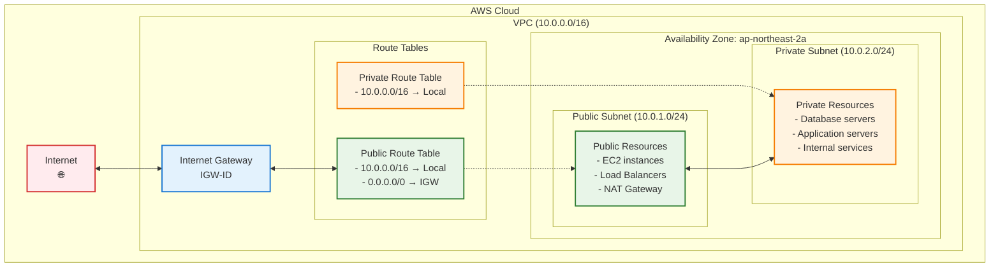
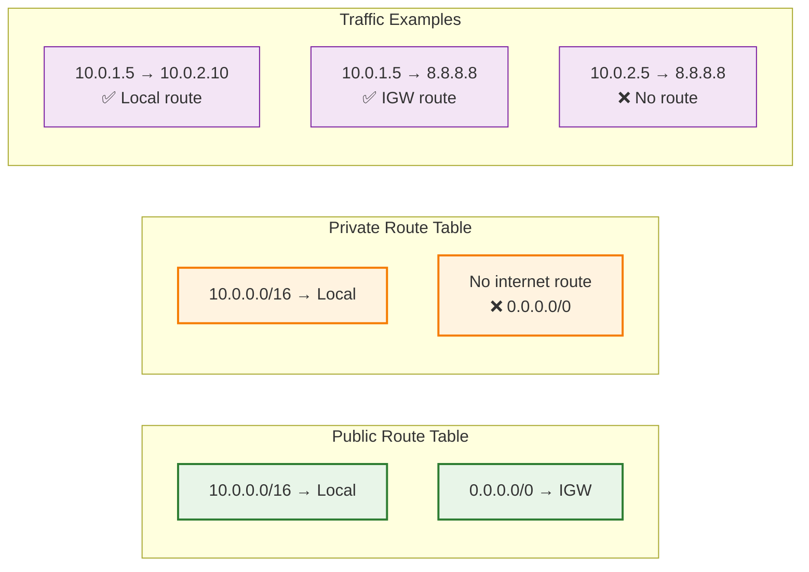

# 01. vpc

## 학습 목표

- AWS VPC 네트워킹 기본 개념 이해
- Public/Private Subnet 구분과 용도 파악
- Internet Gateway와 Route Table 역할 이해
- Terraform으로 네트워크 인프라 구성 경험

<br>

## VPC란 무엇인가?

VPC는 Virtual Private Cloud의 약자로, public 클라우드 환경(AWS, GCP, Azure) 위에 논리적으로 독립된 사용자 전용 private 네트워크 환경을 제공하는 기능

대부분의 클라우드 리소스가 VPC가 제공하는 네트워크 레이어 위에서 프로비저닝되므로 매우 중요하다.

<br>

### VPC 구성요소(AWS 기준)

#### IPv4/IPv6 CIDR 블록

VPC 전체 IP 주소 범위를 나타냄.  
ex) 10.0.0.0/16

#### 서브넷(Subnet)

VPC 내부의 IP 범위를 나눈 것.

VPC의 CIDR 블록보다 작은 범위의 CIDR 블록을 가지고 있어야 함.

- 퍼블릭 서브넷: 외부에서 접근 가능
- 프라이빗 서브넷: 외부에서 접근 불가

#### 라우팅 테이블(Route Table)

서브넷에서 나가는 트래픽의 방향을 정의

#### 인터넷 게이트웨이(Internet Gateway, IGW)

퍼블릭 서브넷이 인터넷과 통신할 수 있도록 연결

#### NAT 게이트웨이/NAT 인스턴스

프라이빗 서브넷의 인스턴스 트래픽이 인터넷으로 나갈 수 있도록 하는 장치(들어오는 건 차단함)

#### 네트워크 ACL(NACL)

서브넷 수준의 방화벽.  
Stateless: 요청과 응답을 별도로 관리  
기본값: 모든 트래픽 허용  
IP/포트/프로토콜 기준 허용/거부 규칙 설정

#### 보안 그룹(Security Group)

인스턴스 수준의 방화벽.  
Stateful: 요청 허용 시 응답도 자동 허용  
기본값: 아웃바운드 모두 허용, 인바운드 모두 차단
인바운드/아웃바운드 트래픽을 제어함.

#### VPC 피어링(Peering)

서로 다른 VPC 간 통신을 허용함

#### VPC 엔드포인트(Gateway/Interface Endpoint)

VPC 내부에서 AWS 서비스(S3, DynamoDB 등)에 인터넷 없이 연결 가능

#### DHCP 옵션 세트

도메인 이름, DNS 등 DHCP 관련 설정을 커스터마이징 할 수 있음

#### DNS 호스트네임 설정

퍼블릭 IP에 도메인 이름을 할당할 수 있게 설정

#### Elastic IP

고정 퍼블릭 IP.  
EC2에 할당 가능

#### VPN 게이트웨이/Direct Connect

온프레미스 데이터센터와의 하이브리드 네트워크 연결을 위한 구성 요소

## 실습

### 구성할 아키텍쳐

```
VPC (10.0.0.0/16)
├── Public Subnet (10.0.1.0/24)   # EC2, ALB 등
│   └── Route: 0.0.0.0/0 → IGW
├── Private Subnet (10.0.2.0/24)  # RDS, 내부 서버 등
│   └── Route: Local only
└── Internet Gateway
```

---

전체 네트워크 구조



---

라우팅 테이블



### 파일 구조 및 작성 순서

1. variables.tf

```hcl
variable "project_name" {
    description = "프로젝트 이름"
    type = string
    default = "terraform-practice"
}

variable "environment" {
    description = "환경 (dev, staging, prod)"
    type = string
    default = "dev"
}

variable "vpc_cidr" {
    description = "VPC CIDR 블록"
    type = string
    default = "10.0.0.0/16"
}

variable "availability_zone" {
    description = "가용 영역"
    type = string
    default = "ap-northeast-2a"
}

variable "public_subnet_cidr" {
    description = "Public Subnet CIDR 블록"
    type = string
    default = "10.0.1.0/24"
}

variable "private_subnet_cidr" {
    description = "Private Subnet CIDR 블록"
    type = string
    default = "10.0.2.0/24"
}
```

variable.tf를 작성하여 해당 프로젝트 내에서 사용할 변수들을 지정해놓을 수 있다.  
var.{변수 이름}으로 사용할 수 있음.

2. main.tf

```hcl
terraform {
    required_version = ">=1.12.2"
    required_providers {
        aws = {
            source = "hashicorp/aws"
            version = "~> 5.0"
        }
    }
}

provider "aws" {
    region = "ap-northeast-2"
}

# 1. VPC 생성
resource "aws_vpc" "main" {
    cidr_block = var.vpc_cidr
    enable_dns_hostnames = true
    enable_dns_support = true

    tags = {
        Name = "${var.project_name}-vpc"
        Environment = var.environment
    }
}

# 2. Internet Gateway 생성
resource "aws_internet_gateway" "main" {
    vpc_id = aws_vpc.main.id

    tags = {
        Name = "${var.project_name}-igw"
        Environment = var.environment
    }
}

# 3. Public Subnet 생성
resource "aws_subnet" "public" {
    vpc_id = aws_vpc.main.id
    cidr_block = var.public_subnet_cidr
    availability_zone = var.availability_zone
    map_public_ip_on_launch = true

    tags = {
        Name = "${var.project_name}-public-subnet"
        Environment = var.environment
        Type = "Public"
    }
}

# 4. Private Subnet 생성
resource "aws_subnet" "private" {
    vpc_id = aws_vpc.main.id
    cidr_block = var.private_subnet_cidr
    availability_zone = var.availability_zone

    tags = {
        Name = "${var.project_name}-private-subnet"
        Environment = var.environment
        Type = "Private"
    }
}

#5. Public Route Table 생성
resource "aws_route_table" "public" {
    vpc_id = aws_vpc.main.id

    # Internet Gateway로 향하는 라우트
    route {
        cidr_block = "0.0.0.0/0"
        gateway_id = aws_internet_gateway.main.id
    }

    tags = {
        Name = "${var.project_name}-public-rt"
        Environment = var.environment
        Type = "Public"
    }
}

# 6. Private Route Table 생성
resource "aws_route_table" "private" {
    vpc_id = aws_vpc.main.id

    # 로컬 라우트만(기본값)

    tags = {
        Name = "${var.project_name}-private-rt"
        Environment = var.environment
        Type = "Private"
    }
}

# 7. Public Subnet과 Public Route Table 연결
resource "aws_route_table_association" "public" {
    subnet_id = aws_subnet.public.id
    route_table_id = aws_route_table.public.id
}

# 8.Private Subnet과 Private Route Table 연결
resource "aws_route_table_association" "private" {
    subnet_id = aws_subnet.private.id
    route_table_id = aws_route_table.private.id
}
```

- 리소스 이름을 'main' 으로 짓는 이유?

  1. 관례적인 이유: 많은 예제에서 사용
  2. 단순함: 하나의 리소스만 있을 때 직관적임
  3. 확장성: 추가 리소스가 필요하면 'secondary', 'sub' 등으로 확장 가능

- 리소스 별로 필요한 속성은 어디서 보나?
  https://registry.terraform.io/providers/hashicorp/aws/latest/docs

- `map_public_ip_on_launch` 라는 속성은 무슨 역할을 하나?  
  서브넷에서 시작되는 인스턴스에 자동으로 퍼블릭 IP 할당 여부 설정

3. output.tf

```hcl
output "vpc_id" {
  description = "VPC ID"
  value       = aws_vpc.main.id
}

output "vpc_cidr_block" {
  description = "VPC CIDR 블록"
  value       = aws_vpc.main.cidr_block
}

output "internet_gateway_id" {
  description = "Internet Gateway ID"
  value       = aws_internet_gateway.main.id
}

output "public_subnet_id" {
  description = "Public Subnet ID"
  value       = aws_subnet.public.id
}

output "private_subnet_id" {
  description = "Private Subnet ID"
  value       = aws_subnet.private.id
}

output "public_route_table_id" {
  description = "Public Route Table ID"
  value       = aws_route_table.public.id
}

output "private_route_table_id" {
  description = "Private Route Table ID"
  value       = aws_route_table.private.id
}

# 다음 단계에서 사용할 정보들
output "network_info" {
  description = "네트워크 정보 요약"
  value = {
    vpc_id             = aws_vpc.main.id
    public_subnet_id   = aws_subnet.public.id
    private_subnet_id  = aws_subnet.private.id
    availability_zone  = var.availability_zone
  }
}
```

### 실습 진행 단계

```bash
# 1. 초기화
terraform init

# 2. 계획 확인
terraform plan

# 3. 실제 적용
terraform apply

# 4. 생성된 리소스 확인
terraform output

# 5. AWS CLI로 확인 (선택사항)
aws ec2 describe-vpcs --vpc-ids $(terraform output -raw vpc_id)
```

## References

https://docs.aws.amazon.com/ko_kr/vpc/latest/userguide/what-is-amazon-vpc.html
https://aws.amazon.com/ko/vpc/
https://www.samsungsds.com/kr/network-vpc/vpc.html
https://velog.io/@yenicall/AWS-VPC%EC%9D%98-%EA%B0%9C%EB%85%90
