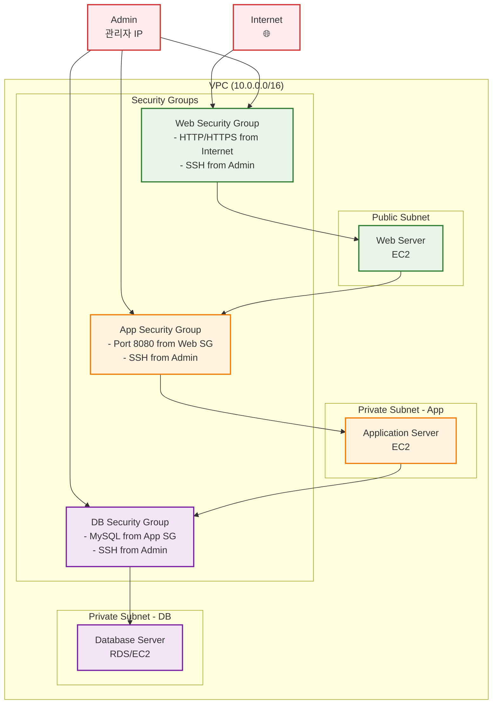
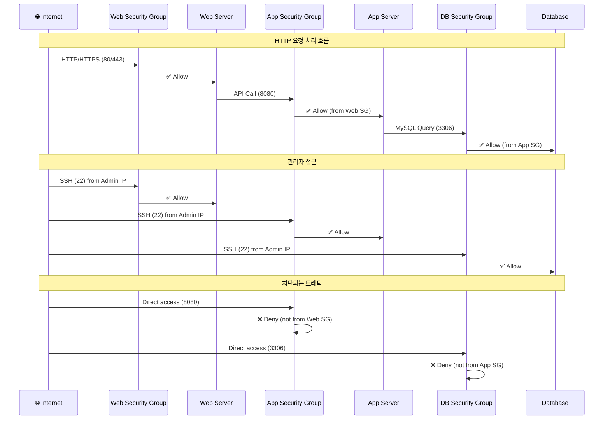
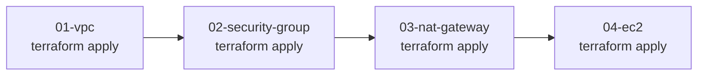

# 02. security group

## 학습 목표

- AWS Security Group의 역할과 동작 원리 이해
- Inbound/Outbound 규칙 설계 및 구현 경험
- Stateful 방화벽의 특성과 장점 파악
- 실무에서 사용하는 보안 그룹 패턴 학습
- Terraform으로 네트워크 보안 정책 관리 경험

<br>

## Security Group이란 무엇인가?

보안 그룹은 인스턴스에 도달하고 나갈 수 있는 트래픽을 제어하는 가상 방화벽이다.  
같은 가상 방화벽인 NACL은 서브넷 단위로 설정, 서브넷 내의 모든 인스턴스에 적용되는 반면,  
보안 그룹은 개별 인스턴스에 적용이 가능하다.

또한 NACL은 stateless, 보안 그룹은 stateful 한 것이 특징이다.

### Security Group 기본 동작 원리

- **기본 정책**: 모든 인바운드 차단, 모든 아웃바운드 허용
- **허용 규칙만 존재**: Deny 규칙은 설정할 수 없음 (화이트리스트 방식)
- **여러 보안 그룹 적용**: 하나의 인스턴스에 최대 5개까지 적용 가능
- **규칙 평가**: 모든 허용 규칙 중 하나라도 매치되면 허용

### Stateful vs Stateless

stateful: 요청 정보를 저장하여 응답하는 트래픽은 제어를 하지 않는다.

stateless: 요청 정보를 따로 저장하지 않아 응답하는 트래픽도 제어를 해주어야 한다.

따라서 보안 그룹의 inbound 규칙을 통과하여 인스턴스에 도달한 요청에 대한 응답은 outbound 규칙에 맞지 않더라도 나갈 수 있다는 뜻이다.

ex.

```bash
# 웹 서버 보안 그룹 설정
Inbound: Port 80 from 0.0.0.0/0 허용
Outbound: 기본 설정 (모든 트래픽 허용)

# 실제 동작
1. 클라이언트(1.2.3.4) → 웹서버(10.0.1.10:80) 요청
   ✅ Inbound 규칙 매치, 허용

2. 웹서버(10.0.1.10) → 클라이언트(1.2.3.4:랜덤포트) 응답
   ✅ 1번 요청에 대한 응답이므로 포트 번호가 80이 아니더라도 자동 허용
   (Outbound 규칙 확인 안 함)
```

### NACL vs Security Group

| 항목          | Security Group                | Network ACL        |
| ------------- | ----------------------------- | ------------------ |
| **적용 범위** | ENI(인스턴스) 수준            | 서브넷 수준        |
| **상태 관리** | Stateful                      | Stateless          |
| **규칙 타입** | Allow만 가능                  | Allow/Deny 모두    |
| **규칙 평가** | 모든 규칙 확인 후 허용        | 번호 순서대로 평가 |
| **기본 정책** | 인바운드 차단/아웃바운드 허용 | 모든 트래픽 허용   |
| **적용 개수** | 인스턴스당 최대 5개           | 서브넷당 1개       |
| **규칙 개수** | 그룹당 최대 120개             | NACL당 최대 40개   |

### Security Group 구성요소

#### Inbound Rules (인바운드 규칙)

**외부에서 인스턴스로 들어오는 트래픽**을 제어하는 규칙

**구성 요소:**

- **프로토콜**: TCP, UDP, ICMP 등
- **포트**: 인스턴스가 서비스를 제공하는 포트 (Destination Port)
- **소스(Source)**: 트래픽을 보내는 출발지
  - CIDR 블록 (예: 0.0.0.0/0, 10.0.0.0/16)
  - 다른 보안 그룹 (예: sg-12345678)
  - 자기 자신 (self)

**예시**: 웹 서버가 인터넷에서 HTTP 요청을 받는 경우

- 프로토콜: TCP
- 포트: 80
- 소스: 0.0.0.0/0 (모든 IP)

#### Outbound Rules (아웃바운드 규칙)

**인스턴스에서 외부로 나가는 트래픽**을 제어하는 규칙

**구성 요소:**

- **프로토콜**: TCP, UDP, ICMP 등
- **포트**: 연결하려는 외부 서비스의 포트 (Destination Port)
- **목적지(Destination)**: 트래픽을 보낼 대상
  - CIDR 블록, 보안 그룹, self 등 (인바운드와 동일)

**예시**: 웹 서버가 외부 데이터베이스에 연결하는 경우

- 프로토콜: TCP
- 포트: 3306 (MySQL)
- 목적지: 10.0.2.0/24 (DB 서브넷)

**기본 정책**:

- Inbound: 모든 트래픽 차단 (명시적 허용 필요)
- Outbound: 모든 트래픽 허용 (필요시 제한 가능)

#### 포트와 프로토콜

##### 일반적으로 사용하는 포트들

```text
웹 서비스:

- HTTP: 80
- HTTPS: 443

데이터베이스:

- MySQL: 3306
- PostgreSQL: 5432
- MongoDB: 27017
- Redis: 6379

관리/접근:

- SSH: 22
- RDP: 3389
- FTP: 21

애플리케이션:

- Node.js: 3000, 8000
- Spring Boot: 8080
- React Dev: 3000
```

##### 프로토콜 종류와 선택 기준

```text
TCP: 연결 지향, 신뢰성 필요 (웹, DB, SSH)
UDP: 비연결, 속도 중요 (DNS, 스트리밍)
ICMP: 네트워크 진단 (ping)
ALL: 모든 프로토콜 허용
```

포트 범위 지정

```text
# 단일 포트
port = 80

# 포트 범위
from_port = 8000
to_port = 8099

# 모든 포트
from_port = 0
to_port = 65535
```

#### Source와 Destination

##### IP 주소 지정 방법

```text
0.0.0.0/0        # 모든 IP (인터넷 전체)
10.0.0.0/16      # VPC 내부
192.168.1.100/32 # 특정 IP 하나
203.0.113.0/24   # 특정 네트워크 대역
```

##### 보안 그룹 참조

```hcl
# 다른 보안 그룹을 소스로 지정
security_groups = [aws_security_group.web.id]

# 예시: DB 보안 그룹에서
inbound_rules = [
  {
    from_port       = 3306
    to_port         = 3306
    protocol        = "tcp"
    security_groups = [aws_security_group.app.id]  # App SG만 허용
  }
]
```

##### 접두사 리스트(Prefix List)

```text
pl-12345678  # AWS 서비스 IP 대역 (S3, CloudFront 등)
```

##### Self 참조

```hcl
# 같은 보안 그룹 내 인스턴스 간 통신
self = true
```

##### 예시

```hcl
# Web 서버 보안 그룹
resource "aws_security_group" "web" {
  # 인바운드: 인터넷에서 HTTP/HTTPS 허용
  ingress {
    from_port   = 80
    to_port     = 80
    protocol    = "tcp"
    cidr_blocks = ["0.0.0.0/0"]  # Source: 전 세계
  }

  # 인바운드: 관리자 IP에서만 SSH
  ingress {
    from_port   = 22
    to_port     = 22
    protocol    = "tcp"
    cidr_blocks = [var.admin_ip]  # Source: 관리자 IP만
  }
}

# DB 서버 보안 그룹
resource "aws_security_group" "database" {
  # 인바운드: App 서버에서만 MySQL 접근
  ingress {
    from_port       = 3306
    to_port         = 3306
    protocol        = "tcp"
    security_groups = [aws_security_group.app.id]  # Source: App SG만
  }
}
```

### 보안 그룹 설정 시 유의점

**BAD CASES**

- '0.0.0.0/000' 으로 SSH(22) 포트 개방 -> 보안 위험
- 불필요한 포트 범위 개방 (0-65535)
- 아웃바운드 규칙을 과도하게 제한하여 정상 동작 방해

**BEST CASES**

- SSH는 특정 IP 대역에서만 허용
- 애플리케이션별로 별도 보안 그룹 생성
- 보안 그룹 간 참조 활용으로 유연한 구조 설계

**보안 그룹 변경 시**

- **즉시 적용**: 보안 그룹 규칙 변경은 즉시 모든 연결된 인스턴스에 적용
- **기존 연결 유지**: 이미 설정된 연결은 끊어지지 않음 (Stateful 특성)
- **삭제 제한**: 다른 보안 그룹에서 참조 중인 경우 삭제 불가

<br>

## 실습

### 구성할 보안 그룹 아키텍처

```
VPC (10.0.0.0/16)
├── Web Security Group
│   ├── Inbound: HTTP(80), HTTPS(443) from 0.0.0.0/0
│   ├── Inbound: SSH(22) from Admin IP
│   └── Outbound: All traffic
├── App Security Group
│   ├── Inbound: HTTP(8080) from Web SG
│   ├── Inbound: SSH(22) from Admin IP
│   └── Outbound: All traffic
└── DB Security Group
    ├── Inbound: MySQL(3306) from App SG
    ├── Inbound: SSH(22) from Admin IP
    └── Outbound: All traffic
```

Admin(관리자)은 **각 보안 그룹의 SSH 규칙을 통해** 웹 서버, 애플리케이션 서버, DB 서버에 접근 가능.

인터넷 사용자는 **Web Security Group의 HTTP/HTTPS 규칙을 통해서만** 웹 서버 접근 가능.

각 계층 간 통신은 **보안 그룹 참조를 통해** 제어됨:

- Web → App: Web SG에서 App SG로
- App → DB: App SG에서 DB SG로

---

보안 그룹 구조 다이어그램



---

트래픽 흐름과 보안 규칙



### 파일 구조 및 작성 순서

기존 01-vpc 에서 작성한 리소스들을 활용하여 실습을 진행



<br>

1. **02-security-group/variables.tf** (설정 가능한 값들)

```hcl
variable "project_name" {
  description = "프로젝트 이름"
  type        = string
  default     = "terraform-practice"
}

variable "environment" {
  description = "환경 (dev, staging, prod)"
  type        = string
  default     = "dev"
}

variable "admin_ip" {
  description = "관리자 IP (SSH 접근용)"
  type        = string
  default     = "0.0.0.0/0" # 실습용, 실제로는 본인 IP 입력
}

```

2. **02-security-group/main.tf** (기존 VPC 정보 참조, 보안 그룹 리소스)

```hcl
terraform {
  required_version = ">=1.12.2"
  required_providers {
    aws = {
      source  = "hashicorp/aws"
      version = "~> 5.0"
    }
  }
}

provider "aws" {
  region = "ap-northeast-2"
}

data "aws_vpc" "main" {
  filter {
    name   = "tag:Name"
    values = ["${var.project_name}-vpc"]
  }
}

resource "aws_security_group" "web" {
  name_prefix = "${var.project_name}-web-"
  description = "Security group for web servers"
  vpc_id      = data.aws_vpc.main.id

  # Inbound Rules
  # HTTP 접근 허용
  ingress {
    description = "HTTP from internet"
    from_port   = 80
    to_port     = 80
    protocol    = "tcp"
    cidr_blocks = ["0.0.0.0/0"]
  }

  # HTTPS 접근 허용
  ingress {
    description = "HTTPS from internet"
    from_port   = 443
    to_port     = 443
    protocol    = "tcp"
    cidr_blocks = ["0.0.0.0/0"]
  }

  # SSH 접근 허용 (관리자 IP에서만)
  ingress {
    description = "SSH from admin"
    from_port   = 22
    to_port     = 22
    protocol    = "tcp"
    cidr_blocks = [var.admin_ip]
  }

  # Outbound Rules
  # 모든 아웃바운드 트래픽 허용 (기본값)
  egress {
    description = "All outbound traffic"
    from_port   = 0
    to_port     = 0
    protocol    = "-1"
    cidr_blocks = ["0.0.0.0/0"]
  }

  tags = {
    Name        = "${var.project_name}-web-sg"
    Environment = var.environment
    Type        = "Web"
  }
}

resource "aws_security_group" "app" {
  name_prefix = "${var.project_name}-app-"
  description = "Security group for application servers"
  vpc_id      = data.aws_vpc.main.id

  # Inbound Rules
  # HTTP 8080 접근 허용 (Web Security Group에서만)
  ingress {
    description     = "HTTP 8080 from web servers"
    from_port       = 8080
    to_port         = 8080
    protocol        = "tcp"
    security_groups = [aws_security_group.web.id]
  }

  # SSH 접근 허용 (관리자 IP에서만)
  ingress {
    description = "SSH from admin"
    from_port   = 22
    to_port     = 22
    protocol    = "tcp"
    cidr_blocks = [var.admin_ip]
  }

  # Outbound Rules
  # 모든 아웃바운드 트래픽 허용
  egress {
    description = "All outbound traffic"
    from_port   = 0
    to_port     = 0
    protocol    = "-1"
    cidr_blocks = ["0.0.0.0/0"]
  }

  tags = {
    Name        = "${var.project_name}-app-sg"
    Environment = var.environment
    Type        = "Application"
  }
}

resource "aws_security_group" "db" {
  name_prefix = "${var.project_name}-db-"
  description = "Security group for database servers"
  vpc_id      = data.aws_vpc.main.id

  # Inbound Rules
  # MySQL 접근 허용 (App Security Group에서만)
  ingress {
    description     = "MySQL from app servers"
    from_port       = 3306
    to_port         = 3306
    protocol        = "tcp"
    security_groups = [aws_security_group.app.id]
  }

  # SSH 접근 허용 (관리자 IP에서만)
  ingress {
    description = "SSH from admin"
    from_port   = 22
    to_port     = 22
    protocol    = "tcp"
    cidr_blocks = [var.admin_ip]
  }

  # Outbound Rules
  # 모든 아웃바운드 트래픽 허용
  egress {
    description = "All outbound traffic"
    from_port   = 0
    to_port     = 0
    protocol    = "-1"
    cidr_blocks = ["0.0.0.0/0"]
  }

  tags = {
    Name        = "${var.project_name}-db-sg"
    Environment = var.environment
    Type        = "Database"
  }
}

```

3. **02-security-group/outputs.tf** (결과값 출력)

```hcl
# 생성된 보안 그룹 ID들 출력
# outputs.tf

# Security Group IDs (다음 단계에서 참조용)
output "web_security_group_id" {
  description = "Web Security Group ID"
  value       = aws_security_group.web.id
}

output "app_security_group_id" {
  description = "App Security Group ID"
  value       = aws_security_group.app.id
}

output "db_security_group_id" {
  description = "DB Security Group ID"
  value       = aws_security_group.db.id
}

# Security Group Names
output "web_security_group_name" {
  description = "Web Security Group Name"
  value       = aws_security_group.web.name
}

output "app_security_group_name" {
  description = "App Security Group Name"
  value       = aws_security_group.app.name
}

output "db_security_group_name" {
  description = "DB Security Group Name"
  value       = aws_security_group.db.name
}

# VPC 정보 (참조한 VPC 확인용)
output "vpc_id" {
  description = "Referenced VPC ID"
  value       = data.aws_vpc.main.id
}

output "vpc_cidr_block" {
  description = "Referenced VPC CIDR block"
  value       = data.aws_vpc.main.cidr_block
}

# 다음 단계에서 사용할 종합 정보
output "security_groups_info" {
  description = "Security Groups 정보 요약"
  value = {
    vpc_id             = data.aws_vpc.main.id
    web_sg_id          = aws_security_group.web.id
    app_sg_id          = aws_security_group.app.id
    db_sg_id           = aws_security_group.db.id
    admin_ip           = var.admin_ip
  }
}

# 보안 그룹 규칙 요약 (확인용)
output "security_rules_summary" {
  description = "보안 그룹 규칙 요약"
  value = {
    web_inbound = [
      "HTTP(80) from 0.0.0.0/0",
      "HTTPS(443) from 0.0.0.0/0",
      "SSH(22) from ${var.admin_ip}"
    ]
    app_inbound = [
      "HTTP(8080) from Web SG",
      "SSH(22) from ${var.admin_ip}"
    ]
    db_inbound = [
      "MySQL(3306) from App SG",
      "SSH(22) from ${var.admin_ip}"
    ]
    all_outbound = "All traffic allowed"
  }
}
```

### 실습 진행 단계

#### 📋 사전 요구사항

```bash
# 1. 01-vpc가 먼저 완료되어 있어야 함
cd 01-vpc
terraform output  # VPC가 정상 생성되었는지 확인

# 출력 예시:
# vpc_id = "vpc-0123456789abcdef0"
# vpc_cidr_block = "10.0.0.0/16"
```

#### 🚀 Step 02 실습 시작

```bash
# 1. 디렉토리 설정
mkdir 02-security-group
cd 02-security-group

# 2. Terraform 파일 작성
# variables.tf - 변수 정의
# main.tf - provider, data, security groups
# outputs.tf - 결과값 출력

# 3. 초기화
terraform init

# 4. 계획 확인
terraform plan
# 예상: 3개의 security group 생성 예정

# 5. 실제 적용
terraform apply
# 입력: yes

# 6. 생성된 리소스 확인
terraform output

# 7. AWS CLI로 상세 확인 (선택사항)
aws ec2 describe-security-groups --group-ids $(terraform output -raw web_security_group_id)

# 8. 정리 (실습 완료 후)
terraform destroy
# 입력: yes
```

#### 🔍 실습 확인 방법

```bash
# 1. 모든 보안 그룹 목록 확인
terraform output

# 2. 특정 보안 그룹 규칙 상세 확인
aws ec2 describe-security-groups \
  --group-ids $(terraform output -raw web_security_group_id) \
  --query 'SecurityGroups[*].{GroupId:GroupId,IpPermissions:IpPermissions}' \
  --output table

# 3. 보안 그룹 간 참조 관계 확인
terraform show | grep -A 5 -B 5 "security_groups"

# 4. VPC 연결 상태 확인
aws ec2 describe-security-groups \
  --filters "Name=vpc-id,Values=$(terraform output -raw vpc_id)" \
  --query 'SecurityGroups[*].{GroupName:GroupName,GroupId:GroupId}' \
  --output table

# 5. 보안 그룹 규칙 요약 확인
terraform output security_rules_summary
```

#### ⚠️ 문제 해결

**VPC를 찾을 수 없다는 에러가 발생하는 경우:**

```bash
# 01-vpc가 정상 생성되었는지 확인
cd ../01-vpc
terraform show | grep -A 5 "aws_vpc"

# VPC 태그 확인
aws ec2 describe-vpcs --filters "Name=tag:Name,Values=terraform-practice-vpc"
```

**보안 그룹 생성 실패 시:**

```bash
# variables.tf에서 project_name이 01-vpc와 동일한지 확인
# admin_ip 형식이 올바른지 확인 (예: "203.0.113.100/32")
```

#### 🎯 성공 확인 기준

✅ **terraform plan 단계**

- 3개의 security group 생성 예정
- 0개 변경, 0개 삭제
- VPC 참조 성공

✅ **terraform apply 후**

- 모든 output 값 정상 출력
- security_groups_info에 모든 ID 포함
- AWS Console에서 보안 그룹 3개 확인 가능

✅ **보안 설정 검증**

- Web SG: HTTP(80), HTTPS(443), SSH(22) 규칙 존재
- App SG: HTTP(8080) from Web SG, SSH(22) 규칙 존재
- DB SG: MySQL(3306) from App SG, SSH(22) 규칙 존재

#### 🔄 다음 단계 준비

```bash
# Step 03 준비를 위해 02-security-group 유지
# terraform destroy 하지 말고 다음 실습에서 참조
```

#### 📊 실습 결과 예시

```bash
$ terraform output

app_security_group_id = "sg-0a1b2c3d4e5f6g7h8"
db_security_group_id = "sg-0i1j2k3l4m5n6o7p8"
security_groups_info = {
  "admin_ip" = "203.0.113.100/32"
  "app_sg_id" = "sg-0a1b2c3d4e5f6g7h8"
  "db_sg_id" = "sg-0i1j2k3l4m5n6o7p8"
  "vpc_id" = "vpc-0123456789abcdef0"
  "web_sg_id" = "sg-0q1r2s3t4u5v6w7x8"
}
web_security_group_id = "sg-0q1r2s3t4u5v6w7x8"
# ... 기타 출력값들
```

### 현재 구성의 특징

#### ✅ 보안 강화 요소

- **최소 권한 원칙**: 필요한 포트만 개방
- **계층별 분리**: Web/App/DB 티어별 보안 그룹
- **소스 제한**: 특정 보안 그룹에서만 접근 허용
- **관리 접근 제어**: SSH는 관리자 IP에서만

#### 🔒 적용된 보안 정책

- **Web 티어**: 인터넷에서 HTTP/HTTPS만 허용
- **App 티어**: Web 보안 그룹에서만 접근 허용
- **DB 티어**: App 보안 그룹에서만 접근 허용
- **SSH 접근**: 모든 티어에서 관리자 IP만 허용

#### 🚀 다음 단계 예고

- **Step 03**: NAT Gateway로 Private Subnet 인터넷 접근
- **Step 04**: 실제 EC2 인스턴스 배포 및 보안 그룹 테스트
- **Step 05**: Auto Scaling Group과 Load Balancer

## 참고 사항

### 보안 그룹 vs NACL 비교

| 항목          | Security Group       | Network ACL      |
| ------------- | -------------------- | ---------------- |
| **적용 범위** | 인스턴스(ENI) 수준   | 서브넷 수준      |
| **상태 관리** | Stateful             | Stateless        |
| **규칙 타입** | Allow만 가능         | Allow/Deny 모두  |
| **규칙 평가** | 모든 규칙 확인       | 순서대로 평가    |
| **기본 정책** | 모든 아웃바운드 허용 | 모든 트래픽 허용 |

### 실무 보안 그룹 패턴

```hcl
# 1. 공통 관리 보안 그룹
resource "aws_security_group" "admin" {
  name_prefix = "admin-access"
  # SSH, RDP 등 관리 접근
}

# 2. 웹 서버 보안 그룹
resource "aws_security_group" "web" {
  name_prefix = "web-tier"
  # HTTP, HTTPS만 허용
}

# 3. 로드 밸런서 보안 그룹
resource "aws_security_group" "alb" {
  name_prefix = "load-balancer"
  # 80, 443 포트 개방
}
```

## References

https://docs.aws.amazon.com/ko_kr/vpc/latest/userguide/vpc-security-groups.html
https://inpa.tistory.com/entry/AWS-%F0%9F%93%9A-VPC-%EA%B0%9C%EB%85%90-%EC%82%AC%EC%9A%A9-%EB%B3%B4%EC%95%88-%EC%84%A4%EC%A0%95-Security-Group-NACL  
https://kingofbackend.tistory.com/257  
https://potato-yong.tistory.com/84  
https://dbjh.tistory.com/65  
https://honglab.tistory.com/153  
https://m.blog.naver.com/techtrip/221732911078
