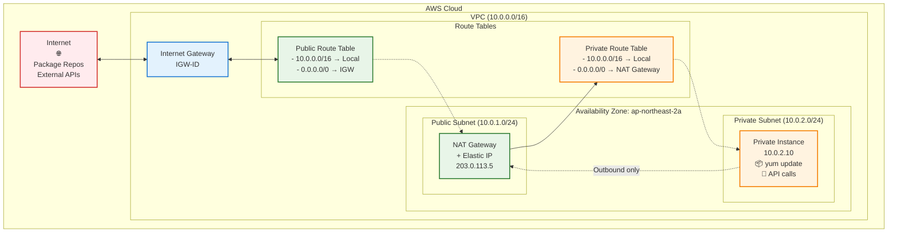
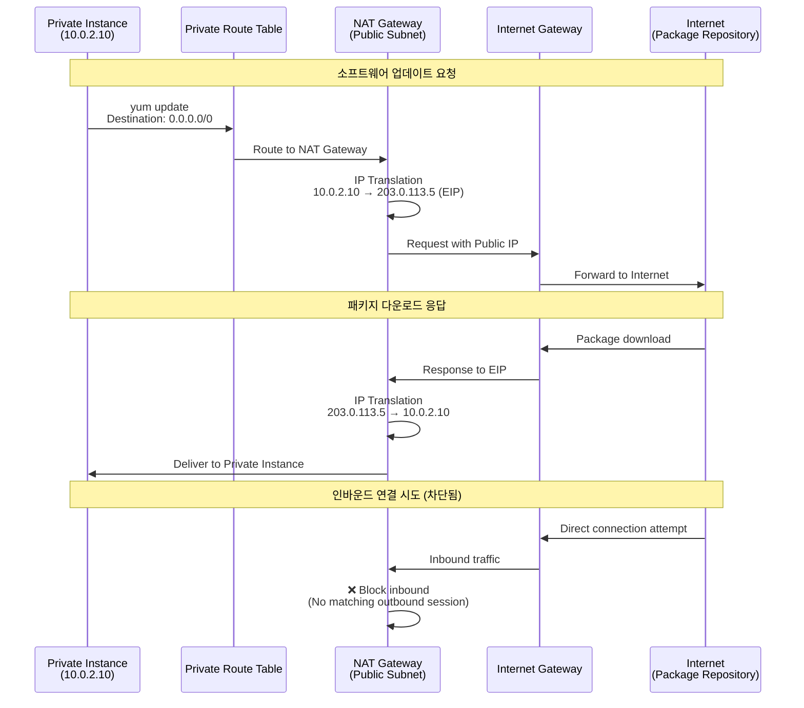
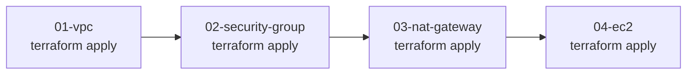

# 03. NAT Gateway

## 학습 목표

- AWS NAT Gateway의 역할과 동작 원리 이해
- Private Subnet의 아웃바운드 인터넷 접근 구현 경험
- NAT Gateway vs NAT Instance 차이점 파악
- Terraform으로 네트워크 라우팅 구성 관리 경험
- Private Subnet 인스턴스의 소프트웨어 업데이트/패키지 설치 시나리오 학습

<br>

## NAT Gateway란 무엇인가?

NAT Gateway는 **Network Address Translation Gateway**의 약자로, Private Subnet의 인스턴스들이 인터넷에 아웃바운드 연결을 할 수 있도록 해주는 AWS 관리형 서비스이다.

Private Subnet의 인스턴스들은 보안상 직접적인 인터넷 접근이 차단되어 있지만, 소프트웨어 업데이트나 외부 API 호출 등을 위해서는 아웃바운드 인터넷 접근이 필요하다.

### NAT Gateway 기본 동작 원리

- **단방향 통신**: Private → Public (인바운드 차단, 아웃바운드만 허용)
- **IP 주소 변환**: Private IP를 Public IP로 변환하여 통신
- **상태 추적**: 연결 상태를 기억하여 응답 트래픽 허용 (Stateful)
- **고가용성**: AWS가 관리하는 서비스로 자동 장애 조치 지원

### NAT를 사용하는 이유

#### 보안성
- Private Subnet 인스턴스에 직접적인 인터넷 접근 차단
- 인바운드 트래픽은 완전히 차단, 아웃바운드만 허용

#### 아웃바운드 요구사항
- 소프트웨어 업데이트 (yum, apt, pip 등)
- 외부 API 서비스 호출
- 데이터 백업을 위한 S3 업로드
- Docker 이미지 다운로드

### NAT Gateway vs NAT Instance

| 항목 | NAT Gateway | NAT Instance |
| --- | --- | --- |
| **관리 주체** | AWS 완전 관리형 | 사용자 직접 관리 |
| **가용성** | 자동 다중화 지원 | 수동 설정 필요 |
| **성능** | 최대 45 Gbps | 인스턴스 성능에 의존 |
| **보안 그룹** | 적용 불가 | 적용 가능 |
| **포트 포워딩** | 지원 안함 | 지원 |
| **배스천 호스트** | 사용 불가 | 사용 가능 |
| **비용** | 시간당 고정 요금 | 인스턴스 요금만 |

### NAT Gateway 구성요소

#### Elastic IP 주소
- NAT Gateway에 할당되는 고정 Public IP
- 외부와 통신할 때 사용되는 주소
- 삭제하기 전까지 변경되지 않음

#### 위치
- **반드시 Public Subnet에 배치**
- Internet Gateway와 통신 가능한 위치여야 함
- 각 AZ마다 별도 NAT Gateway 권장 (고가용성)

#### 라우팅
- Private Route Table에 NAT Gateway로의 라우팅 규칙 추가
- 목적지: `0.0.0.0/0` (모든 인터넷 트래픽)
- 대상: NAT Gateway ID

### 트래픽 흐름 예시

```
Private Instance (10.0.2.10) 
    ↓ yum update 요청
Private Route Table (0.0.0.0/0 → NAT Gateway)
    ↓
NAT Gateway (Public Subnet)
    ↓ IP 변환: 10.0.2.10 → 203.0.113.5 (EIP)
Internet Gateway
    ↓
인터넷 (패키지 저장소)
    ↓ 응답
NAT Gateway (IP 역변환)
    ↓
Private Instance
```

<br>

## 실습

### 구성할 아키텍처

```
VPC (10.0.0.0/16)
├── Public Subnet (10.0.1.0/24)
│   ├── Internet Gateway
│   └── NAT Gateway + Elastic IP
│       └── Route: 0.0.0.0/0 → IGW
├── Private Subnet (10.0.2.0/24)
│   └── Route: 0.0.0.0/0 → NAT Gateway
└── Route Tables
    ├── Public RT: 0.0.0.0/0 → IGW
    └── Private RT: 0.0.0.0/0 → NAT Gateway
```

---

NAT Gateway 아키텍처



---

NAT Gateway 트래픽 흐름



### 파일 구조 및 작성 순서

기존 01-vpc, 02-security-group에서 작성한 리소스들을 활용하여 실습을 진행



<br>

1. **03-nat-gateway/variables.tf** (설정 가능한 값들)

```hcl
variable "project_name" {
  description = "프로젝트 이름"
  type        = string
  default     = "terraform-practice"
}

variable "environment" {
  description = "환경 (dev, staging, prod)"
  type        = string
  default     = "dev"
}

variable "availability_zone" {
  description = "가용 영역"
  type        = string
  default     = "ap-northeast-2a"
}
```

2. **03-nat-gateway/main.tf** (기존 VPC/Subnet 정보 참조, NAT Gateway 생성)

```hcl
terraform {
  required_version = ">=1.12.2"
  required_providers {
    aws = {
      source  = "hashicorp/aws"
      version = "~> 5.0"
    }
  }
}

provider "aws" {
  region = "ap-northeast-2"
}

# 기존 VPC 정보 참조
data "aws_vpc" "main" {
  filter {
    name   = "tag:Name"
    values = ["${var.project_name}-vpc"]
  }
}

# 기존 Public Subnet 정보 참조
data "aws_subnet" "public" {
  filter {
    name   = "tag:Name"
    values = ["${var.project_name}-public-subnet"]
  }
}

# 기존 Private Subnet 정보 참조
data "aws_subnet" "private" {
  filter {
    name   = "tag:Name"
    values = ["${var.project_name}-private-subnet"]
  }
}

# 기존 Private Route Table 정보 참조
data "aws_route_table" "private" {
  filter {
    name   = "tag:Name"
    values = ["${var.project_name}-private-rt"]
  }
}

# 1. Elastic IP 생성 (NAT Gateway용)
resource "aws_eip" "nat" {
  domain = "vpc"
  
  tags = {
    Name        = "${var.project_name}-nat-eip"
    Environment = var.environment
    Purpose     = "NAT Gateway"
  }
}

# 2. NAT Gateway 생성
resource "aws_nat_gateway" "main" {
  allocation_id = aws_eip.nat.id
  subnet_id     = data.aws_subnet.public.id
  
  tags = {
    Name        = "${var.project_name}-nat-gateway"
    Environment = var.environment
  }

  # Internet Gateway가 먼저 생성되어야 함
  depends_on = [aws_eip.nat]
}

# 3. Private Route Table에 NAT Gateway로의 라우트 추가
resource "aws_route" "private_nat" {
  route_table_id         = data.aws_route_table.private.id
  destination_cidr_block = "0.0.0.0/0"
  nat_gateway_id         = aws_nat_gateway.main.id
}
```

3. **03-nat-gateway/outputs.tf** (결과값 출력)

```hcl
# NAT Gateway 정보
output "nat_gateway_id" {
  description = "NAT Gateway ID"
  value       = aws_nat_gateway.main.id
}

output "nat_gateway_private_ip" {
  description = "NAT Gateway Private IP"
  value       = aws_nat_gateway.main.private_ip
}

output "nat_gateway_public_ip" {
  description = "NAT Gateway Public IP (Elastic IP)"
  value       = aws_eip.nat.public_ip
}

# Elastic IP 정보
output "elastic_ip_id" {
  description = "Elastic IP Allocation ID"
  value       = aws_eip.nat.id
}

output "elastic_ip_address" {
  description = "Elastic IP Address"
  value       = aws_eip.nat.public_ip
}

# 참조한 리소스 정보 (확인용)
output "vpc_id" {
  description = "Referenced VPC ID"
  value       = data.aws_vpc.main.id
}

output "public_subnet_id" {
  description = "Referenced Public Subnet ID"
  value       = data.aws_subnet.public.id
}

output "private_subnet_id" {
  description = "Referenced Private Subnet ID"  
  value       = data.aws_subnet.private.id
}

output "private_route_table_id" {
  description = "Referenced Private Route Table ID"
  value       = data.aws_route_table.private.id
}

# 다음 단계에서 사용할 종합 정보
output "nat_gateway_info" {
  description = "NAT Gateway 정보 요약"
  value = {
    nat_gateway_id    = aws_nat_gateway.main.id
    elastic_ip        = aws_eip.nat.public_ip
    vpc_id           = data.aws_vpc.main.id
    public_subnet_id = data.aws_subnet.public.id
    private_subnet_id = data.aws_subnet.private.id
  }
}

# 네트워크 구성 요약 (확인용)
output "network_summary" {
  description = "네트워크 구성 요약"
  value = {
    vpc_cidr = data.aws_vpc.main.cidr_block
    public_subnet_cidr = data.aws_subnet.public.cidr_block
    private_subnet_cidr = data.aws_subnet.private.cidr_block
    nat_gateway_location = "Public Subnet"
    private_internet_route = "0.0.0.0/0 → NAT Gateway"
  }
}
```

### 실습 진행 단계

#### 📋 사전 요구사항

```bash
# 1. 이전 단계들이 완료되어 있어야 함
cd 01-vpc
terraform output  # VPC 정상 생성 확인

cd ../02-security-group  
terraform output  # Security Group 정상 생성 확인

# 출력 예시 확인:
# vpc_id = "vpc-0123456789abcdef0"
# public_subnet_id = "subnet-0123456789abcdef0"
# private_subnet_id = "subnet-0fedcba987654321"
```

#### 🚀 Step 03 실습 시작

```bash
# 1. 디렉토리 설정
mkdir 03-nat-gateway
cd 03-nat-gateway

# 2. Terraform 파일 작성
# variables.tf - 변수 정의
# main.tf - provider, data sources, NAT gateway, route
# outputs.tf - 결과값 출력

# 3. 초기화
terraform init

# 4. 계획 확인
terraform plan
# 예상: Elastic IP, NAT Gateway, Route 생성 예정

# 5. 실제 적용
terraform apply
# 입력: yes

# 6. 생성된 리소스 확인
terraform output

# 7. AWS CLI로 상세 확인 (선택사항)
aws ec2 describe-nat-gateways --nat-gateway-ids $(terraform output -raw nat_gateway_id)

# 8. Route Table 확인
aws ec2 describe-route-tables --route-table-ids $(terraform output -raw private_route_table_id)
```

#### 🔍 실습 확인 방법

```bash
# 1. NAT Gateway 상태 확인
terraform output nat_gateway_info

# 2. Elastic IP 할당 상태 확인
aws ec2 describe-addresses --allocation-ids $(terraform output -raw elastic_ip_id)

# 3. Private Route Table의 라우팅 규칙 확인
aws ec2 describe-route-tables \
  --route-table-ids $(terraform output -raw private_route_table_id) \
  --query 'RouteTables[*].Routes[*].{Destination:DestinationCidrBlock,Target:NatGatewayId}' \
  --output table

# 4. NAT Gateway 네트워크 인터페이스 확인
aws ec2 describe-network-interfaces \
  --filters "Name=description,Values=*NAT Gateway*" \
  --query 'NetworkInterfaces[*].{Description:Description,PrivateIp:PrivateIpAddress,SubnetId:SubnetId}' \
  --output table

# 5. 전체 네트워크 구성 요약 확인
terraform output network_summary
```

#### ⚠️ 문제 해결

**VPC나 Subnet을 찾을 수 없다는 에러:**

```bash
# 이전 단계 리소스들이 정상인지 확인
cd ../01-vpc
terraform show | grep -A 3 "resource.*vpc"

# 태그 이름이 정확한지 확인
aws ec2 describe-subnets --filters "Name=tag:Name,Values=terraform-practice-*subnet"
```

**NAT Gateway 생성 실패:**

```bash
# Public Subnet이 정말 Public인지 확인 (IGW 연결 여부)
aws ec2 describe-route-tables --filters "Name=association.subnet-id,Values=$(terraform output -raw public_subnet_id)"

# Elastic IP 할당 제한 확인
aws ec2 describe-addresses --query 'Addresses[*].{AllocationId:AllocationId,PublicIp:PublicIp}'
```

#### 🎯 성공 확인 기준

✅ **terraform plan 단계**
- 3개 리소스 생성 예정 (EIP, NAT Gateway, Route)
- 0개 변경, 0개 삭제
- 모든 data source 정상 참조

✅ **terraform apply 후**
- NAT Gateway 상태: `available`
- Elastic IP 정상 할당
- Private Route Table에 0.0.0.0/0 → NAT Gateway 라우트 추가

✅ **네트워크 설정 검증**
```bash
# Private Route Table 확인
aws ec2 describe-route-tables --route-table-ids $(terraform output -raw private_route_table_id) \
  --query 'RouteTables[*].Routes[?DestinationCidrBlock==`0.0.0.0/0`]'

# 결과: NAT Gateway ID가 표시되어야 함
```

#### 🔄 다음 단계 준비

```bash
# Step 04에서 Private Subnet에 EC2를 배포하여 NAT Gateway 테스트 예정
# terraform destroy 하지 말고 다음 실습에서 활용
```

#### 📊 실습 결과 예시

```bash
$ terraform output

elastic_ip_address = "203.0.113.5"
nat_gateway_id = "nat-0123456789abcdef0"
nat_gateway_info = {
  "elastic_ip" = "203.0.113.5"
  "nat_gateway_id" = "nat-0123456789abcdef0"
  "private_subnet_id" = "subnet-0fedcba987654321"
  "public_subnet_id" = "subnet-0123456789abcdef0"
  "vpc_id" = "vpc-0123456789abcdef0"
}
network_summary = {
  "nat_gateway_location" = "Public Subnet"
  "private_internet_route" = "0.0.0.0/0 → NAT Gateway"
  "private_subnet_cidr" = "10.0.2.0/24"
  "public_subnet_cidr" = "10.0.1.0/24" 
  "vpc_cidr" = "10.0.0.0/16"
}
```

### NAT Gateway 비용 고려사항

#### 요금 구조
- **시간당 요금**: 약 $0.045/시간 (서울 리전 기준)
- **데이터 처리 요금**: $0.045/GB
- **Elastic IP**: NAT Gateway 연결 시 무료 (미사용 시 과금)

#### 비용 최적화 방안
```hcl
# 개발 환경용: 비용 절약을 위한 조건부 생성
resource "aws_nat_gateway" "main" {
  count = var.environment == "prod" ? 1 : 0
  
  allocation_id = aws_eip.nat[0].id
  subnet_id     = data.aws_subnet.public.id
}

# 개발 환경에서는 NAT Instance 사용 고려
# 또는 필요시에만 생성 후 삭제
```

### 고가용성 구성 (Production 환경)

```hcl
# 멀티 AZ NAT Gateway 구성 예시
resource "aws_nat_gateway" "main" {
  for_each = var.availability_zones
  
  allocation_id = aws_eip.nat[each.key].id
  subnet_id     = aws_subnet.public[each.key].id
  
  tags = {
    Name = "${var.project_name}-nat-${each.key}"
  }
}

# AZ별 Route Table 구성
resource "aws_route" "private_nat" {
  for_each = var.availability_zones
  
  route_table_id         = aws_route_table.private[each.key].id
  destination_cidr_block = "0.0.0.0/0"
  nat_gateway_id         = aws_nat_gateway.main[each.key].id
}
```

## 참고 사항

### NAT Gateway vs NAT Instance 선택 가이드

#### NAT Gateway 선택 시
- **운영 관리 최소화** 필요
- **고성능, 고가용성** 요구
- **예산에 여유** 있음
- **자동 스케일링** 필요

#### NAT Instance 선택 시  
- **비용 최적화** 우선순위
- **포트 포워딩** 필요
- **커스텀 설정** 요구
- **배스천 호스트** 겸용

### 보안 고려사항

```hcl
# NAT Gateway 로그 활성화 (VPC Flow Logs)
resource "aws_flow_log" "nat_gateway" {
  iam_role_arn    = aws_iam_role.flow_log.arn
  log_destination = aws_cloudwatch_log_group.nat_gateway.arn
  traffic_type    = "ALL"
  vpc_id          = data.aws_vpc.main.id
}

# Private Subnet 보안 강화
resource "aws_network_acl" "private" {
  vpc_id     = data.aws_vpc.main.id
  subnet_ids = [data.aws_subnet.private.id]
  
  # 아웃바운드만 허용
  egress {
    rule_no    = 100
    protocol   = "-1"
    cidr_block = "0.0.0.0/0"
  }
  
  # 응답 트래픽만 허용 (Ephemeral Ports)
  ingress {
    rule_no    = 100  
    protocol   = "tcp"
    from_port  = 1024
    to_port    = 65535
    cidr_block = "0.0.0.0/0"
  }
}
```

### 다음 단계에서 테스트할 시나리오

1. **EC2 인스턴스 배포** (Step 04)
   - Private Subnet에 EC2 생성
   - NAT Gateway를 통한 인터넷 접근 테스트

2. **실제 사용 사례 검증**
   ```bash
   # Private Instance에서 실행 예정
   sudo yum update -y          # 패키지 업데이트
   curl -s http://httpbin.org/ip  # 외부 IP 확인
   wget https://www.google.com    # 웹 다운로드 테스트
   ```

3. **모니터링 및 로그 분석**
   - CloudWatch에서 NAT Gateway 메트릭 확인
   - VPC Flow Logs로 트래픽 패턴 분석

## References

https://docs.aws.amazon.com/ko_kr/vpc/latest/userguide/vpc-nat-gateway.html

https://docs.aws.amazon.com/ko_kr/vpc/latest/userguide/nat-gateway-scenarios.html

https://aws.amazon.com/ko/blogs/networking-and-content-delivery/vpc-sharing-a-new-approach-to-multiple-accounts-and-vpc-management/

https://medium.com/awesome-cloud/aws-vpc-difference-between-internet-gateway-and-nat-gateway-c9177e710af6

https://inpa.tistory.com/entry/AWS-%F0%9F%93%9A-NAT-Gateway-NAT-Instance-%EB%8C%80%EC%B2%B4%ED%95%B4%EC%84%9C-%EB%B9%84%EC%9A%A9-%EC%A0%88%EC%95%BD