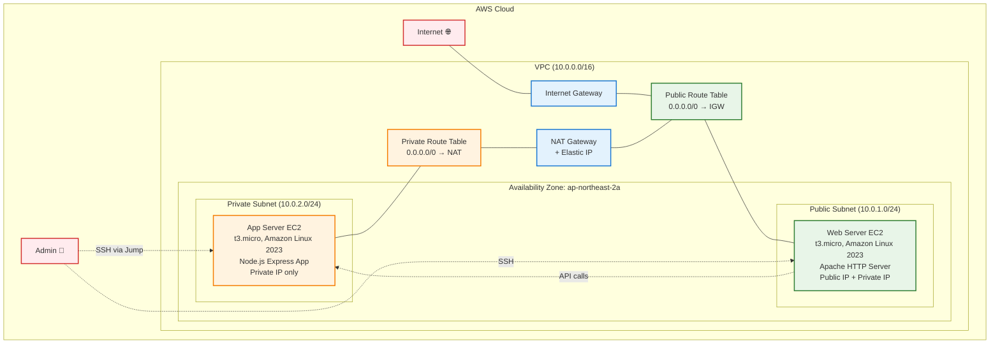
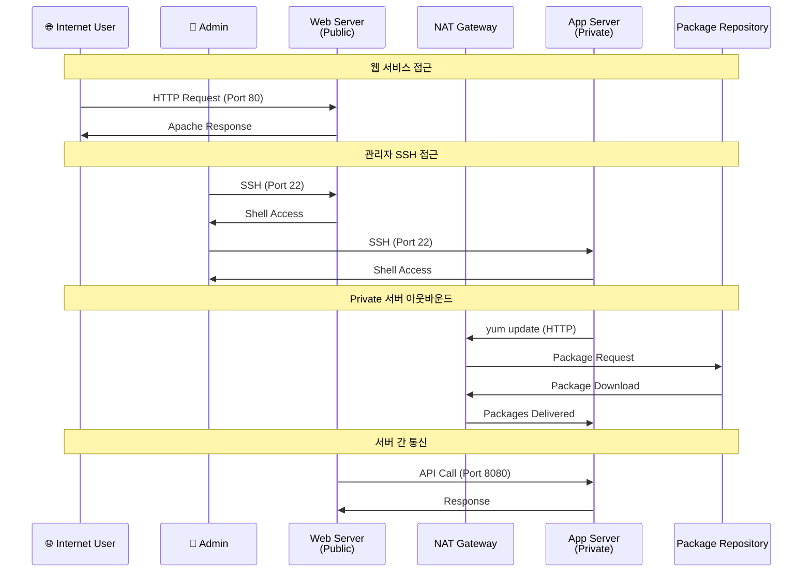
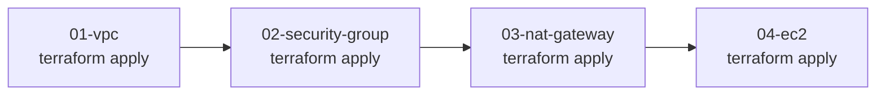

# 04. EC2

## 학습목표

- EC2 인스턴스 생성 및 관리 방법 이해
- Public/Private 서브넷에서의 EC2 배포 차이점 파악
- user_data를 통한 인스턴스 초기화 스크립트 작성 경험
- SSH 키 페어 생성 및 관리 실습
- 보안 그룹과 EC2 인스턴스 연결 실습
- NAT Gateway를 통한 Private 서브넷 아웃바운드 인터넷 접근 검증
- 실제 웹 서버와 애플리케이션 서버 구동 경험

<br>

## EC2란?

EC2(Elastic Compute Cloud)는 AWS에서 제공하는 확장 가능한 클라우드 컴퓨팅 서비스  
물리 서버를 구매하고 설치하는 대신 가상 서버를 몇 분 안에 생성하고 관리할 수 있게 해준다.

컴퓨팅 리소스를 유연하게 확장하거나 축소할 수 있다.

### EC2 핵심 특징

#### 탄력성

- 수직 확장: 인스턴스 타입 변경으로 CPU/메모리 업그레이드 가능
- 수평 확장: Auto Scaling Group으로 인스턴스 개수 자동 조절
- 프로비저닝: 몇 분 내에 새 서버 생성 가능

#### 비용 효율성

- 온디맨드: 시간당 고정 요금
- 예약 인스턴스: 1~3년 약정으로 할인, 운영 환경에 적합
- 스팟 인스턴스: 가격 변동, 중단 가능성 있음, 배치 작업에 적합
- 프리 티어: t3.micro 월 750시간, 실습용으로 충분

#### 완전한 제어권

- Root 권한: 운영체제 수준의 완전한 접근 권한
- 사용자 정의: 필요한 소프트웨어 자유롭게 설치 및 구성
- 다양한 OS: Linux, Windows, macOS 지원

<br>

### EC2 인스턴스 타입


#### 범용

- t3.micro, t3.small, t3.medium, t3.large
- m5.large, m5.xlarge 등

#### CPU 최적화

- c5.large, c5.xlarge, c5.2xlarge

#### 메모리 최적화

- r5.large, r5.xlarge, r5.2xlarge

#### 스토리지 최적화

- i3.large
- d3.xlarge

[그 밖의 인스턴스 유형 참고](https://aws.amazon.com/ko/ec2/instance-types/)

### AMI(Amazon Machine Image)

인스턴스를 시작하는 데 필요한 모든 정보(운영체제, 설치된 소프트웨어 등)를 포함한 템플릿

AMI로 인스턴스를 구성하면 바로 동일 환경을 재현할 수 있다.  
수십, 수백 대 인스턴스를 생성할 때도 동일한 환경이 보장되어 오토스케일링에 적합

장애 환경 복구에도 활용 가능

#### 구성 요소

- 루트 볼륨 템플릿: 운영체제, 애플리케이션 서버, 애플리케이션
- 시작 권한: AMI를 사용할 수 있는 AWS 계정 제어
- 블록 디바이스 매핑: 인스턴스 시작 시 연결할 볼륨 지정

#### AMI 유형

AWS 제공 AMI:

- Amazon Linux 2023 (최신, 권장)
- Amazon Linux 2 (LTS)
- Ubuntu Server 22.04 LTS
- Windows Server 2022
- Red Hat Enterprise Linux 9

커뮤니티 AMI:

- 사용자가 공개한 AMI
- 특정 용도에 최적화된 구성

사용자 정의 AMI:

- 기존 인스턴스에서 생성
- 표준화된 환경 구성
- 빠른 배포 및 확장

#### AMI 선택 기준:

- 성능: 최적화된 커널 및 드라이버
- 보안: 정기 보안 업데이트 제공
- 호환성: 애플리케이션 요구사항 충족
- 비용: 라이선스 비용 고려

### EC2의 스토리지 옵션

#### EBS(Elastic Block Store)

특징

- 네트워크 연결 스토리지
- 인스턴스와 독립적인 수명 주기
- 스냅샷을 통한 백업
- 암호화 지원
- 99.999% 가용성

유형

- gp3 (General Purpose SSD): 범용, 가격 대비 성능 우수
- io2 (Provisioned IOPS SSD): 고성능, 높은 IOPS
- st1 (Throughput Optimized HDD): 빅데이터, 로그 처리
- sc1 (Cold HDD): 백업, 아카이브용 저비용

#### 인스턴스 스토어(Instance Store)

특징

- 물리적으로 연결된 SSD/HDD
- 매우 높은 성능 (최대 수백만 IOPS)
- 임시 스토리지 (인스턴스 중지 시 데이터 손실)
- 스냅샷 불가

용도

- 임시 데이터 처리
- 캐시
- 높은 성능이 필요한 워크로드

### EC2의 네트워킹 기능

#### Elastic Network Instance(ENI)

기능

- 여러 개의 네트워크 인터페이스 연결
- 보조 Private IP 주소 할당
- Elastic IP 주소 연결
- MAC 주소 유지
- 보안 그룹 적용

#### 배치 그룹(Placement Groups)

클러스터: 단일 AZ 내 밀집 배치 (높은 네트워크 성능)  
분산: 여러 하드웨어에 분산 배치 (고가용성)  
파티션: 서로 다른 파티션에 분산 (대규모 분산 시스템)

#### Enhanced Networking

SR-IOV: 네트워크 가상화 오버헤드 제거  
ENA (Elastic Network Adapter): 최대 100Gbps 네트워크 성능  
Intel 82599 VF: 레거시 인스턴스용 고성능 네트워킹

<br>

### EC2 고급 기능

#### EC2 User Data

- 인스턴스 시작 시 자동 실행되는 스크립트
- 소프트웨어 설치, 설정 변경, 서비스 시작 등 자동화
- 이번 실습에서 웹 서버, 애플리케이션 서버 설정 자동화에 사용

```bash
#!/bin/bash
yum update -y
yum install -y httpd
systemctl start httpd
echo "<h1>Hello from $(hostname)</h1>" > /var/www/html/index.html
```

#### SSH 키 페어

- EC2 인스턴스에 안전하게 접속하기 위한 공개키 암호화 방식
- 이번 실습에서 Public/Private 서브넷 인스턴스 접속에 사용

#### 이후 단계에서 다룰 고급 기능들

Step 15 (CloudWatch): 상세 모니터링, 로그 수집, 알람 설정  
Step 16 (IAM): IAM 역할을 통한 AWS 서비스 권한 관리  
Step 19 (Bastion Host): Systems Manager Session Manager 활용  
Step 20 (Backup): 스냅샷 및 백업 전략

<br>

### Public vs Private 서브넷 배포

#### Public 서브넷 EC2

- Internet Gateway 연결: 직접적인 인터넷 접근
- Public IP 자동 할당: 외부에서 접근 가능
- 용도: 웹 서버, 로드 밸런서, Bastion Host

#### Private 서브넷 EC2

NAT Gateway 통한 아웃바운드: 인터넷으로 나가는 트래픽만 가능

- Public IP 없음: 외부에서 직접 접근 불가
- 용도: 애플리케이션 서버, 데이터베이스 서버

<br>

## 실습

### 구성할 아키텍처

```
VPC (10.0.0.0/16)
├── Public Subnet (10.0.1.0/24)
│   ├── Web Server EC2 (t3.micro)
│   │   ├── Web Security Group
│   │   ├── Apache HTTP Server
│   │   └── Public IP: Auto-assign
│   └── Internet Gateway Access
├── Private Subnet (10.0.2.0/24)
│   ├── App Server EC2 (t3.micro)
│   │   ├── App Security Group
│   │   ├── Basic Development Tools
│   │   └── NAT Gateway Access
│   └── Route: 0.0.0.0/0 → NAT Gateway
└── SSH Key Pair
    └── terraform-practice-key
```

### EC2 인스턴스 아키텍처



### 트래픽 흐름 및 접근 패턴



<br>

### 파일 구조 및 작성 순서

기존 01-vpc, 02-security-group, 03-nat-gateway에서 작성한 리소스들을 활용하여 실습을 진행



<br>

### 실습 진행 단계

#### 📋 사전 요구사항

#### 🚀 Step 04 실습 시작

#### 🔍 실습 확인 방법

#### ⚠️ 문제 해결

#### 🎯 성공 확인 기준

#### 📊 실습 결과 예시

## References

https://docs.aws.amazon.com/ko_kr/AWSEC2/latest/UserGuide/concepts.html

https://aws.amazon.com/ko/ec2/features/

https://aws.amazon.com/ko/ec2/instance-types/

https://docs.aws.amazon.com/ko_kr/AWSEC2/latest/UserGuide/AMIs.html

https://inpa.tistory.com/entry/AWS-%F0%9F%93%9A-EC2-%EA%B0%9C%EB%85%90-%EC%82%AC%EC%9A%A9-%EA%B5%AC%EC%B6%95-%EC%84%B8%ED%8C%85-%F0%9F%92%AF-%EC%A0%95%EB%A6%AC-%EC%9D%B8%EC%8A%A4%ED%84%B4%EC%8A%A4-EBS-AMI

https://inpa.tistory.com/entry/AWS-%F0%9F%93%9A-AMI-Snapshot-%EA%B0%9C%EB%85%90-%EB%B0%B1%EC%97%85-%EC%82%AC%EC%9A%A9%EB%B2%95-%F0%9F%92%AF-%EC%A0%95%EB%A6%AC
