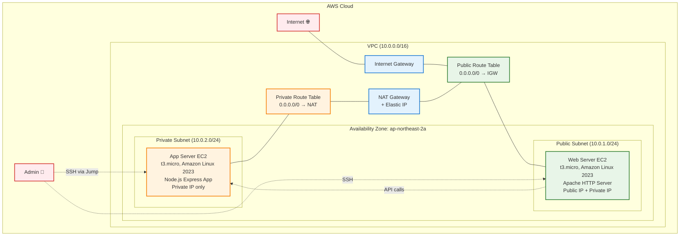
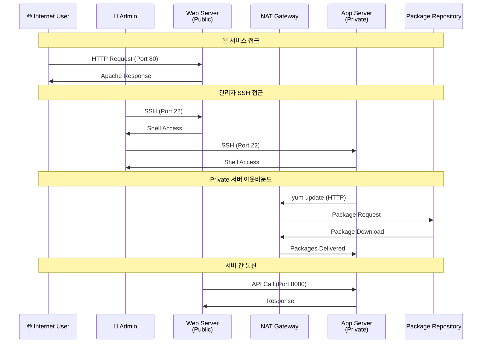
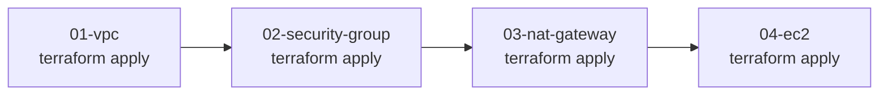

# 04. EC2

## 학습목표

- EC2 인스턴스 생성 및 관리 방법 이해
- Public/Private 서브넷에서의 EC2 배포 차이점 파악
- user_data를 통한 인스턴스 초기화 스크립트 작성 경험
- SSH 키 페어 생성 및 관리 실습
- 보안 그룹과 EC2 인스턴스 연결 실습
- NAT Gateway를 통한 Private 서브넷 아웃바운드 인터넷 접근 검증
- 실제 웹 서버와 애플리케이션 서버 구동 경험

<br>

## EC2란?

EC2(Elastic Compute Cloud)는 AWS에서 제공하는 확장 가능한 클라우드 컴퓨팅 서비스  
물리 서버를 구매하고 설치하는 대신 가상 서버를 몇 분 안에 생성하고 관리할 수 있게 해준다.

컴퓨팅 리소스를 유연하게 확장하거나 축소할 수 있다.

### EC2 핵심 특징

#### 탄력성

- 수직 확장: 인스턴스 타입 변경으로 CPU/메모리 업그레이드 가능
- 수평 확장: Auto Scaling Group으로 인스턴스 개수 자동 조절
- 프로비저닝: 몇 분 내에 새 서버 생성 가능

#### 비용 효율성

- 온디맨드: 시간당 고정 요금
- 예약 인스턴스: 1~3년 약정으로 할인, 운영 환경에 적합
- 스팟 인스턴스: 가격 변동, 중단 가능성 있음, 배치 작업에 적합
- 프리 티어: t3.micro 월 750시간, 실습용으로 충분

#### 완전한 제어권

- Root 권한: 운영체제 수준의 완전한 접근 권한
- 사용자 정의: 필요한 소프트웨어 자유롭게 설치 및 구성
- 다양한 OS: Linux, Windows, macOS 지원

<br>

### EC2 인스턴스 타입


#### 범용

- t3.micro, t3.small, t3.medium, t3.large
- m5.large, m5.xlarge 등

#### CPU 최적화

- c5.large, c5.xlarge, c5.2xlarge

#### 메모리 최적화

- r5.large, r5.xlarge, r5.2xlarge

#### 스토리지 최적화

- i3.large
- d3.xlarge

[그 밖의 인스턴스 유형 참고](https://aws.amazon.com/ko/ec2/instance-types/)

<br>

### AMI(Amazon Machine Image)

인스턴스를 시작하는 데 필요한 모든 정보(운영체제, 설치된 소프트웨어 등)를 포함한 템플릿

AMI로 인스턴스를 구성하면 바로 동일 환경을 재현할 수 있다.  
수십, 수백 대 인스턴스를 생성할 때도 동일한 환경이 보장되어 오토스케일링에 적합

장애 환경 복구에도 활용 가능

#### 구성 요소

- 루트 볼륨 템플릿: 운영체제, 애플리케이션 서버, 애플리케이션
- 시작 권한: AMI를 사용할 수 있는 AWS 계정 제어
- 블록 디바이스 매핑: 인스턴스 시작 시 연결할 볼륨 지정

#### AMI 유형

AWS 제공 AMI:

- Amazon Linux 2023 (최신, 권장)
- Amazon Linux 2 (LTS)
- Ubuntu Server 22.04 LTS
- Windows Server 2022
- Red Hat Enterprise Linux 9

커뮤니티 AMI:

- 사용자가 공개한 AMI
- 특정 용도에 최적화된 구성

사용자 정의 AMI:

- 기존 인스턴스에서 생성
- 표준화된 환경 구성
- 빠른 배포 및 확장

#### AMI 선택 기준:

- 성능: 최적화된 커널 및 드라이버
- 보안: 정기 보안 업데이트 제공
- 호환성: 애플리케이션 요구사항 충족
- 비용: 라이선스 비용 고려

<br>

### EC2의 스토리지 옵션

#### EBS(Elastic Block Store)

특징

- 네트워크 연결 스토리지
- 인스턴스와 독립적인 수명 주기
- 스냅샷을 통한 백업
- 암호화 지원
- 99.999% 가용성

유형

- gp3 (General Purpose SSD): 범용, 가격 대비 성능 우수
- io2 (Provisioned IOPS SSD): 고성능, 높은 IOPS
- st1 (Throughput Optimized HDD): 빅데이터, 로그 처리
- sc1 (Cold HDD): 백업, 아카이브용 저비용

#### 인스턴스 스토어(Instance Store)

특징

- 물리적으로 연결된 SSD/HDD
- 매우 높은 성능 (최대 수백만 IOPS)
- 임시 스토리지 (인스턴스 중지 시 데이터 손실)
- 스냅샷 불가

용도

- 임시 데이터 처리
- 캐시
- 높은 성능이 필요한 워크로드

<br>

### EC2의 네트워킹 기능

#### Elastic Network Instance(ENI)

기능

- 여러 개의 네트워크 인터페이스 연결
- 보조 Private IP 주소 할당
- Elastic IP 주소 연결
- MAC 주소 유지
- 보안 그룹 적용

#### 배치 그룹(Placement Groups)

클러스터: 단일 AZ 내 밀집 배치 (높은 네트워크 성능)  
분산: 여러 하드웨어에 분산 배치 (고가용성)  
파티션: 서로 다른 파티션에 분산 (대규모 분산 시스템)

#### Enhanced Networking

SR-IOV: 네트워크 가상화 오버헤드 제거  
ENA (Elastic Network Adapter): 최대 100Gbps 네트워크 성능  
Intel 82599 VF: 레거시 인스턴스용 고성능 네트워킹

<br>

### EC2 고급 기능

#### EC2 User Data

- 인스턴스 시작 시 자동 실행되는 스크립트
- 소프트웨어 설치, 설정 변경, 서비스 시작 등 자동화
- 이번 실습에서 웹 서버, 애플리케이션 서버 설정 자동화에 사용

```bash
#!/bin/bash
yum update -y
yum install -y httpd
systemctl start httpd
echo "<h1>Hello from $(hostname)</h1>" > /var/www/html/index.html
```

#### SSH 키 페어

- EC2 인스턴스에 안전하게 접속하기 위한 공개키 암호화 방식
- 이번 실습에서 Public/Private 서브넷 인스턴스 접속에 사용

#### 이후 단계에서 다룰 고급 기능들

Step 15 (CloudWatch): 상세 모니터링, 로그 수집, 알람 설정  
Step 16 (IAM): IAM 역할을 통한 AWS 서비스 권한 관리  
Step 19 (Bastion Host): Systems Manager Session Manager 활용  
Step 20 (Backup): 스냅샷 및 백업 전략

<br>

### Public vs Private 서브넷 배포

#### Public 서브넷 EC2

- Internet Gateway 연결: 직접적인 인터넷 접근
- Public IP 자동 할당: 외부에서 접근 가능
- 용도: 웹 서버, 로드 밸런서, Bastion Host

#### Private 서브넷 EC2

NAT Gateway 통한 아웃바운드: 인터넷으로 나가는 트래픽만 가능

- Public IP 없음: 외부에서 직접 접근 불가
- 용도: 애플리케이션 서버, 데이터베이스 서버

<br>

## 실습

### 구성할 아키텍처

```
VPC (10.0.0.0/16)
├── Public Subnet (10.0.1.0/24)
│   ├── Web Server EC2 (t3.micro)
│   │   ├── Web Security Group
│   │   ├── Apache HTTP Server
│   │   └── Public IP: Auto-assign
│   └── Internet Gateway Access
├── Private Subnet (10.0.2.0/24)
│   ├── App Server EC2 (t3.micro)
│   │   ├── App Security Group  
│   │   ├── Node.js Express App
│   │   └── Private IP only (외부 직접 접근 불가)
│   └── Route: 0.0.0.0/0 → NAT Gateway (아웃바운드만)
└── SSH Key Pair
    └── terraform-practice-key
```

Private Subnet의 App Server는 인터넷에서 직접 접근할 수 없다.  
Admin은 Web Server를 Jump Host로 사용해서 App Server에 접속해야 함

### EC2 인스턴스 아키텍처



### 트래픽 흐름 및 접근 패턴



<br>

### 파일 구조 및 작성 순서

기존 01-vpc, 02-security-group, 03-nat-gateway에서 작성한 리소스들을 활용하여 실습을 진행



<br>

#### variales.tf

프로젝트 내에서 사용할 변수 정의  
- 프로젝트 이름
- 환경
- 생성할 인스턴스 타입
- 인스턴스에 접근하기 위해 필요한 SSH 키 페어 이름
- 관리자 IP

#### main.tf

재사용
- vpc
- public/private subnet
- security group

신규 생성
- 웹 서버, 앱 서버
- SSH 접속에 필요한 키 페어

#### outputs.tf

#### /user_data/web_server.sh

웹 서버 생성 시 자동 수행될 스크립트
- 패키지 설치
- 간단한 웹 페이지 생성

#### /user_data/app_server.sh

앱 서버 생성 시 자동 수행될 스크립트
- 패키지 설치
- 간단한 node.js 서버 생성

### 실습 진행 단계

#### 📋 사전 요구사항

``` bash
# 1. 이전 단계들이 완료되어 있어야 함
cd ../01-vpc && terraform output  # VPC 정상 생성 확인
cd ../02-security-group && terraform output  # Security Group 정상 생성 확인
cd ../03-nat-gateway && terraform output  # NAT Gateway 정상 생성 확인

# 2. SSH Key Pair 생성 (로컬에서)
ssh-keygen -t rsa -b 2048 -f ~/.ssh/terraform-practice-key -N ""
# 또는 기존 키가 있다면 해당 키 사용
```

#### 🚀 Step 04 실습 시작

``` bash
# 1. 디렉토리 설정
mkdir 04-ec2
cd 04-ec2

# 2. user_data 디렉토리 생성
mkdir user_data

# 3. Terraform 파일 작성
# variables.tf - 변수 정의
# main.tf - provider, data sources, EC2 instances
# user_data/web_server.sh - 웹 서버 초기화 스크립트
# user_data/app_server.sh - 앱 서버 초기화 스크립트
# outputs.tf - 결과값 출력

# 4. 초기화
terraform init

# 5. 계획 확인
terraform plan
# 예상: Key pair 1개, EC2 instance 2개 생성 예정

# 6. 실제 적용
terraform apply
# 입력: yes

# 7. 생성된 리소스 확인
terraform output

# 8. 웹 서비스 접속 테스트
curl $(terraform output -raw web_server_public_ip)

# 9. SSH 접속 테스트 (선택사항)
ssh -i ~/.ssh/terraform-practice-key ec2-user@$(terraform output -raw web_server_public_ip)
```

#### 🔍 실습 확인 방법

1. EC2 인스턴스 상태 확인

``` bash
# 인스턴스 목록 확인
aws ec2 describe-instances \
  --filters "Name=tag:Name,Values=terraform-practice-*-server" \
  --query 'Reservations[*].Instances[*].{Name:Tags[?Key==`Name`]|[0].Value,InstanceId:InstanceId,State:State.Name,PublicIp:PublicIpAddress,PrivateIp:PrivateIpAddress}' \
  --output table

# Terraform outputs 확인
terraform output
```

2. 웹 서비스 동작 확인
``` bash
# 로컬 터미널에서 HTTP 접근 테스트
curl http://$(terraform output -raw web_server_public_ip)

# 브라우저 접속
echo "Web Server URL: http://$(terraform output -raw web_server_public_ip)"
# macOS
open http://$(terraform output -raw web_server_public_ip)
```

3. SSH 접속 및 서버 상태 확인

Web Server 접속:
``` bash
# Web Server 직접 접속
ssh -i ~/.ssh/terraform-practice-key ec2-user@$(terraform output -raw web_server_public_ip)

# Web Server에서 실행할 확인 명령어들
sudo systemctl status httpd
curl localhost
```

App Server 접속 방법 (Jump Host):
Private Subnet은 Route Table에 인바운드 인터넷 경로가 없어서 외부에서 직접 접근이 불가
``` bash
# SSH Agent에 키 등록 후
ssh-add ~/.ssh/terraform-practice-key

ssh -J ec2-user@$(terraform output -raw web_server_public_ip) ec2-user@$(terraform output -raw app_server_private_ip)
```

4. App Server에서 실행할 테스트
``` bash
# Node.js 애플리케이션 확인
curl localhost:8080
curl localhost:8080/health

# NAT Gateway 테스트 스크립트 실행 (권장)
./test_nat_gateway.sh

# 또는 개별 NAT Gateway 테스트
curl -s http://checkip.amazonaws.com  # NAT Gateway IP가 나와야 함
nslookup google.com                   # DNS 테스트
sudo yum install -y tree              # 패키지 설치 테스트

# Node.js 프로세스 확인 (문제 해결용)
ps aux | grep node
```

#### ⚠️ 문제 해결

SSH 키 관련 문제:
``` bash
# 키 파일 권한 확인 및 수정
chmod 600 ~/.ssh/terraform-practice-key
ls -la ~/.ssh/terraform-practice-key*

# 키 페어가 AWS에 등록되었는지 확인
aws ec2 describe-key-pairs --key-names terraform-practice-key
```

user_data 스크립트 실행 확인:
``` bash
# 로그 확인
ssh -i ~/.ssh/terraform-practice-key ec2-user@$(terraform output -raw web_server_public_ip)
sudo tail -f /var/log/cloud-init-output.log
sudo cat /var/log/user_data.log

# 서비스 상태 확인
sudo systemctl status httpd
sudo systemctl status terraform-practice-app
```

보안 그룹 문제:
``` bash
# 현재 내 IP 확인
curl -s http://checkip.amazonaws.com

# variables.tf의 admin_ip를 현재 IP로 업데이트
# terraform apply로 재적용
```

인스턴스 시작 실패:
``` bash
# CloudTrail 또는 AWS Console에서 오류 확인
aws logs describe-log-groups | grep cloudtrail

# 인스턴스 시스템 로그 확인
aws ec2 get-console-output --instance-id $(terraform output -raw web_server_id)
```

웹 서버 접근 안 됨:

``` bash
# SSH 접속 후 수동 설정
sudo yum install -y httpd
sudo systemctl start httpd
sudo systemctl enable httpd
echo "<h1>Hello World</h1>" | sudo tee /var/www/html/index.html
curl localhost
```

App Server 접속 안됨: 

``` bash
# SSH Agent 상태 확인
ssh-add -l

# Agent가 없다면 시작
eval $(ssh-agent)
ssh-add ~/.ssh/terraform-practice-key

# 로컬에서 IP 미리 확인
echo "Web Server Public IP: $(terraform output -raw web_server_public_ip)"
echo "App Server Private IP: $(terraform output -raw app_server_private_ip)"

# 단계별 접속 (IP 직접 사용)
# 확인한 Web Server Public IP 기입
ssh -A ec2-user@43.201.104.248

# 확인한 App Server Private IP 기입
ssh ec2-user@10.0.2.140
```

Node.js 앱 실행 안됨: 
``` bash
# App Server 접속 후 수동 실행
cd /opt/app
npm install
nohup node app.js > /var/log/nodejs-app.log 2>&1 &

# 동작 확인
curl localhost:8080
```


#### 🎯 성공 확인 기준

✅ terraform plan 단계

- 3개 리소스 생성 예정 (Key pair 1개, EC2 instance 2개)
- 0개 변경, 0개 삭제
- 모든 data source 정상 참조

✅ terraform apply 후

- 모든 output 값 정상 출력
- Web Server에 Public IP 할당
- App Server는 Private IP만 존재

✅ 서비스 동작 검증
``` bash
# Web Server HTTP 응답 확인
curl -s http://$(terraform output -raw web_server_public_ip) | grep "Web Server"

# App Server API 응답 확인 (Jump Host 통해)
ssh -i ~/.ssh/terraform-practice-key \
  -J ec2-user@$(terraform output -raw web_server_public_ip) \
  ec2-user@$(terraform output -raw app_server_private_ip) \
  'curl -s localhost:8080 | grep "Application Server"'

# NAT Gateway를 통한 아웃바운드 확인
ssh -i ~/.ssh/terraform-practice-key \
  -J ec2-user@$(terraform output -raw web_server_public_ip) \
  ec2-user@$(terraform output -raw app_server_private_ip) \
  'curl -s http://checkip.amazonaws.com'
```

✅ 아키텍처 검증
- Public Subnet의 EC2가 인터넷에서 직접 접근 가능
- Private Subnet의 EC2가 NAT Gateway를 통해 아웃바운드 가능
- 보안 그룹 규칙에 따른 접근 제어 정상 동작

#### 📊 실습 결과 예시

``` bash
$ terraform output

web_server_public_ip = "203.0.113.123"
app_server_private_ip = "10.0.2.45"

ssh_commands = {
  "app_server_via_web" = "ssh -i ~/.ssh/terraform-practice-key -J ec2-user@203.0.113.123 ec2-user@10.0.2.45"
  "web_server" = "ssh -i ~/.ssh/terraform-practice-key ec2-user@203.0.113.123"
}

web_service_urls = {
  "app_server_api" = "http://10.0.2.45:8080"
  "web_server_http" = "http://203.0.113.123"
  "web_server_info" = "http://203.0.113.123/server-info.php"
}

$ curl http://203.0.113.123
<!DOCTYPE html>
<html>
<head>
    <title>terraform-practice-web Web Server</title>
...
✅ Apache HTTP Server is running!
```

## 참고 사항

EC2 비용 최적화 팁
``` hcl
# Spot Instance 사용 예시 (개발환경)
resource "aws_spot_instance_request" "app_server" {
  count         = var.environment == "dev" ? 1 : 0
  ami           = data.aws_ami.amazon_linux.id
  instance_type = var.instance_type
  spot_price    = "0.01"  # 시간당 최대 $0.01
  
  # 기타 설정...
}
```

고가용성 개선 방안
``` hcl
# 멀티 AZ 배포 예시
variable "availability_zones" {
  default = ["ap-northeast-2a", "ap-northeast-2c"]
}

resource "aws_instance" "web_server" {
  for_each = toset(var.availability_zones)
  
  availability_zone = each.key
  # 기타 설정...
}
```

모니터링 및 로깅 강화
``` hcl
# CloudWatch 에이전트 설치 user_data 추가
#!/bin/bash
# ... 기존 설치 스크립트 ...

# CloudWatch Agent 설치
yum install -y amazon-cloudwatch-agent
# 설정 및 시작...
```

## References

https://docs.aws.amazon.com/ko_kr/AWSEC2/latest/UserGuide/concepts.html

https://aws.amazon.com/ko/ec2/features/

https://aws.amazon.com/ko/ec2/instance-types/

https://docs.aws.amazon.com/ko_kr/AWSEC2/latest/UserGuide/AMIs.html

https://inpa.tistory.com/entry/AWS-%F0%9F%93%9A-EC2-%EA%B0%9C%EB%85%90-%EC%82%AC%EC%9A%A9-%EA%B5%AC%EC%B6%95-%EC%84%B8%ED%8C%85-%F0%9F%92%AF-%EC%A0%95%EB%A6%AC-%EC%9D%B8%EC%8A%A4%ED%84%B4%EC%8A%A4-EBS-AMI

https://inpa.tistory.com/entry/AWS-%F0%9F%93%9A-AMI-Snapshot-%EA%B0%9C%EB%85%90-%EB%B0%B1%EC%97%85-%EC%82%AC%EC%9A%A9%EB%B2%95-%F0%9F%92%AF-%EC%A0%95%EB%A6%AC
